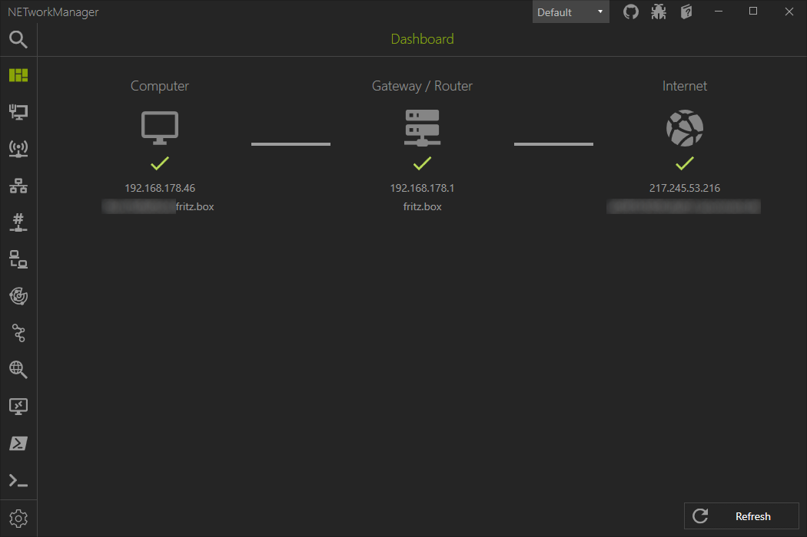

# Dashboard
Description...



## Settings

### Public ICMP test IP address
During the connection test, a ping / ICMP packet is sent to this IP address to determine whether a host can be reached outside of your local network. It can be changed to any IP address as long as this IP address responds to ping / ICMP packets.

**Default**
```
1.1.1.1
```

### Public DNS test domain
Public domain name

**Default**
```
one.one.one.one
```

### Public DNS test IP address
Description...

**Default**
```
1.1.1.1
```

### Check public IP address
Description...

**Default**
```
Enabled
```

### Use custom API
Description...
