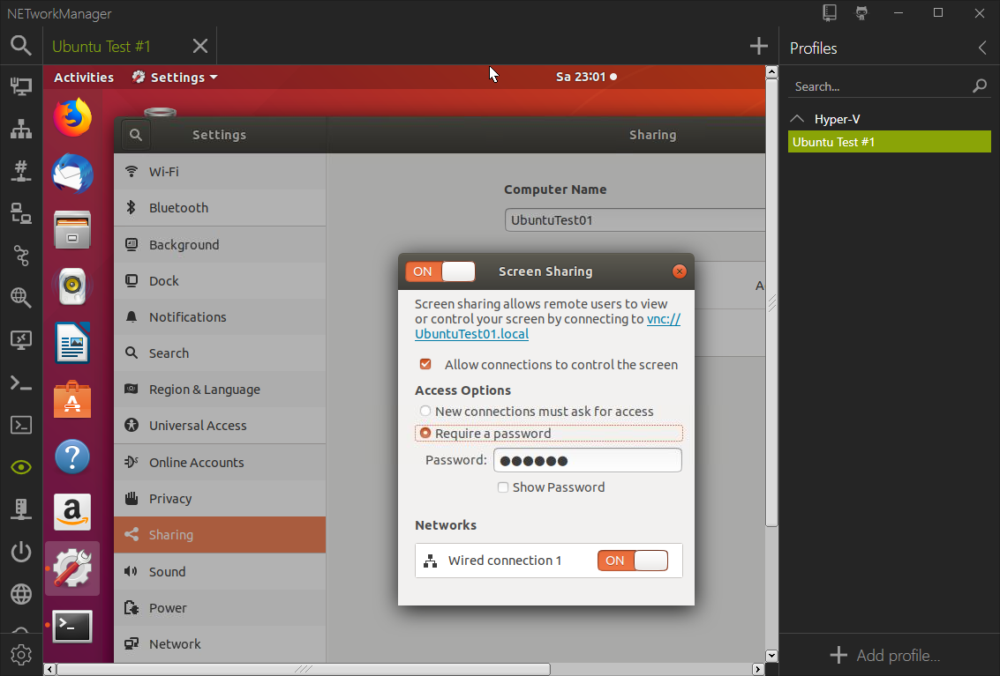

# TigerVNC

You can download TigerVNC from the [offical site](https://tigervnc.org/){:target="_blank"}.

The path to `vncviewer-x.x.x.exe` or` vncviewer64-x.x.x.exe` must be added in the settings.

