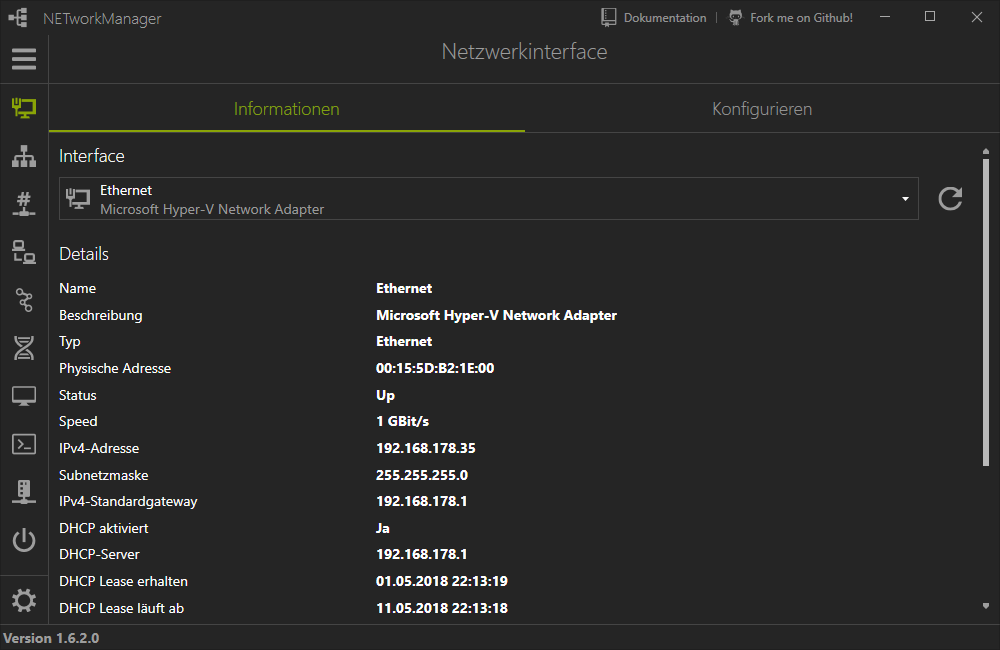
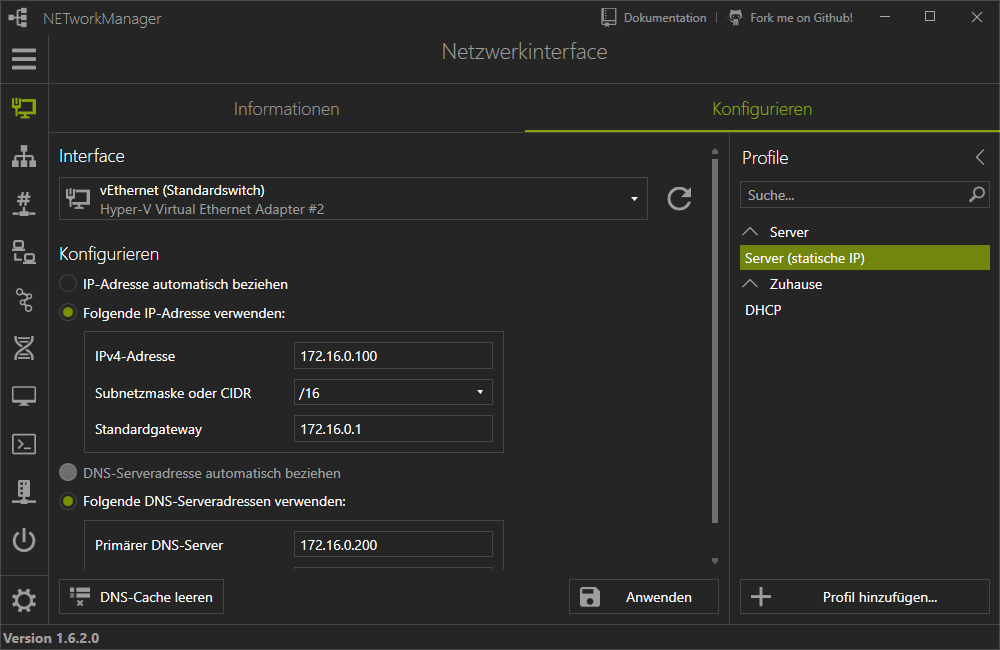
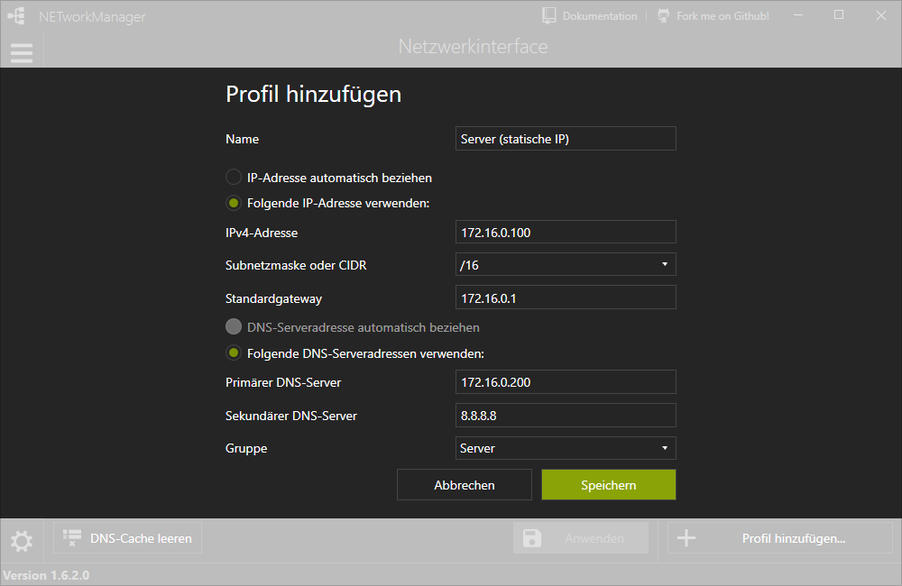

# Netzwerkinterface

Das **Netzwerkinterface** Tool erkennt alle Netzwerkadapter des Computers mit den wichtigsten Informationen (z.B. IP-Adresse, DNS-Server usw.). Verbundene Netzwerkkarten können mit Profilen konfiguriert werden.

## Informationen

## Konfigurieren

[zurück](../README.md)
