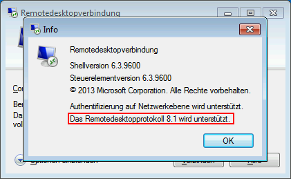

# Wie installiere ich RDP 8.1 unter Windows 7 / Server 2008 R2?

Standardmäßig unterstützen Windows 7 und Server 2008 R2 nur das Remotedesktopprotokoll (RDP) in Version 7.1. Um auf Version 8.1 zu aktualisieren, gehen Sie folgendermaßen vor.

**1) Laden Sie die KBs für Ihr System von Microsoft herunter und wenden Sie sie in der folgenden Reihenfolge an:**

_Für die verschiedenen Systeme gibt es verschiedene Download-Pakete (Windows 7 x86 & x64, Server 2008 R2 x64)._

https://support.microsoft.com/en-us/help/2830477/update-for-remoteapp-and-desktop-connections-feature-is-available-for

- KB2574819
- KB2830477 (Neustart erforderlich)
- KB2857650
- KB2913751

https://support.microsoft.com/en-us/help/2923545/update-for-rdp-8-1-is-available-for-windows-7-sp1

- KB2923545

**2) Windows Update**

Öffnen Sie Windows Update und suchen Sie nach verfügbaren Funktions- und Sicherheitsupdates.

Zu dem Zeitpunkt, als der Artikel geschrieben wurde, sind folgende Updates verfügbar:

- KB3020388
- KB3075226

Starten Sie ggf. Ihr System neu und suchen Sie erneut nach Updates.

**3) Überprüfen ob RDP 8.1 unterstützt wird**

Öffnen Sie die Anwendung "Remotedesktopverbindung" (mstsc.exe) über das Windows Startmenü/Suche und klicken Sie auf _Info_. Im Dialog wird die unterstütze RDP-Version angezeigt.

