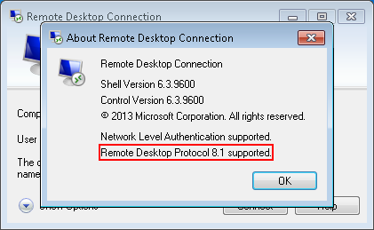

# How to install RDP 8.1 on Windows 7/Server 2008 R2?

By default, Windows 7 and Server 2008 R2 only supports the Remote Desktop Protocol (RDP) in version 7.1. To Upgrade to version 8.1 follow these steps.

**1) Download the KB's for your system from Microsoft and apply them in the following order:**

_There are different download packages for the different systems (Windows 7 x86 & x64, Server 2008 R2 x64)._

https://support.microsoft.com/en-us/help/2830477/update-for-remoteapp-and-desktop-connections-feature-is-available-for

- KB2574819
- KB2830477 (reboot required)
- KB2857650
- KB2913751

https://support.microsoft.com/en-us/help/2923545/update-for-rdp-8-1-is-available-for-windows-7-sp1

- KB2923545

**2) Windows Update**

Open Windows Update and search for available feature and security updates.

At the time when the article was written, the following updates are available:

- KB3020388
- KB3075226

If necessary, restart your system and check for updates again.

**3) Check if RDP 8.1 is supported**

Open the "Remote Desktop Connection" (mstsc.exe) application from the Windows Start menu/Search and click _Info_. The supported RDP version is displayed in the dialog.

