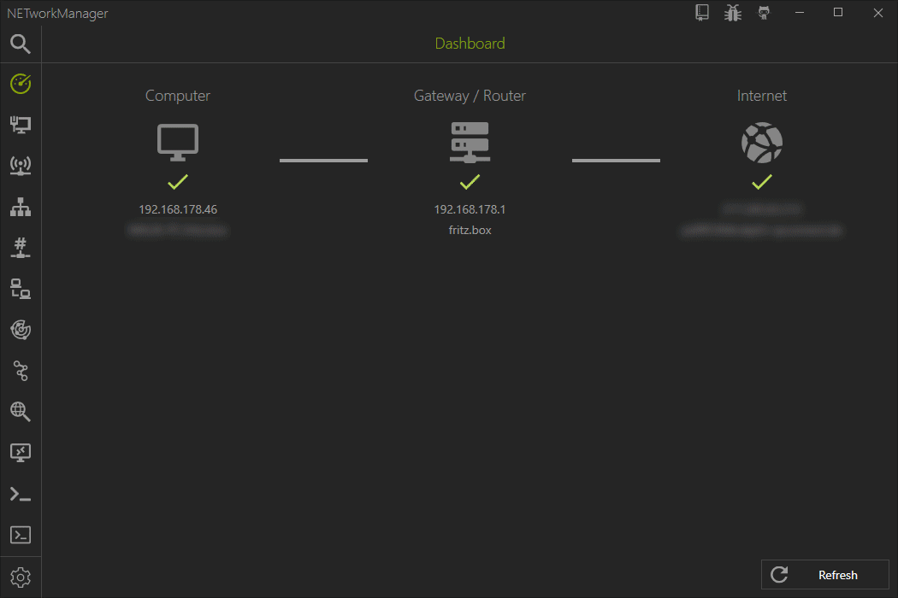

## Welcome

Add some text here...

## Download

| File | Checksum | Description
|---|---|---|
|[Setup](https://github.com/BornToBeRoot/NETworkManager/releases/download/2020.1.0/NETworkManager_2020.1.0_Setup.exe)| `A7BD0182269F012701D56285141A6627` `9F41145F748539C7233C3129BE3765CB` | Installs the software in `%ProgramFiles(x86)%`. Settings are saved in `%AppData%`. See [available parameters](http://www.jrsoftware.org/ishelp/index.php?topic=setupcmdline). |
|[Portable](https://github.com/BornToBeRoot/NETworkManager/releases/download/2020.1.0/NETworkManager_2020.1.0_Portable.zip)| `BEA66D1B8E1DE820B6077FD1F98ABDF5` `BDD4D7CD0477FC27941EFED326DCCEAD` | Portable version for USB-Stick/Cloud. Settings are saved in the program folder. |
|[Archiv](https://github.com/BornToBeRoot/NETworkManager/releases/download/2020.1.0/NETworkManager_2020.1.0_Archiv.zip)| `497C6DEFAD22B074B0E8D0E439485451` `28503512434C096D221D2978B1344F91` | Binaries can be deployed anywhere (network share, etc.). Settings are saved in %AppData%. |
|[Chocolatey](https://chocolatey.org/packages/NETworkManager)| -/- | Package Manager for Windows. Installs the setup via Chocolatey. |

## Preview

## Features

- Dashboard 
- Network Interface - Information, Bandwidth, Configure
- WiFi - Networks, Channels
- IP Scanner
- Port Scanner
- Ping
- Ping Monitor
- Traceroute
- DNS Lookup
- Remote Desktop
- PowerShell
- PuTTY ([requires PuTTY](https://www.chiark.greenend.org.uk/~sgtatham/putty/latest.html))
- TigerVNC ([requires TigerVNC](https://tigervnc.org/))
- Web Console
- SNMP - Get, Walk, Set
- Discovery Protocol - LLDP, CDP
- Wake on LAN
- HTTP Headers
- Whois
- Subnet Calculator - Calculator, Subnetting, Supernetting
- Lookup - OUI, Port
- Connections
- Listeners
- ARP Table

<h2>Documentation</h2>

[Click here!](Documentation/README.md)

<h2>Changelog</h2>

[Click here!](Changelog.md)

<h2>Languages</h2>

Official:
- English
- German
- Russian

Community:
- Chinese
- Brazilian Portuguese
- Dutch
- French
- Italy
- Spanish

Help translate on [Transifex](https://www.transifex.com/BornToBeRoot/NETworkManager).

<h2>System requirements</h2>

- Windows 10 Build 1809 or later
- .NET-Framework 4.7.2

[Last release for Windows 7 / 8.1 and Server 2008 R2 / 2012 R2 / 2016](https://github.com/BornToBeRoot/NETworkManager/releases/tag/v1.11.0.0)

<h2>Thanks</h2>

<h2>License</h2>

This software is published under the [GNU General Public License v3](https://github.com/BornToBeRoot/NETworkManager/blob/master/LICENSE).

The licenses of the libraries, which are used in the program, can be found [here](https://github.com/BornToBeRoot/NETworkManager/tree/master/Source/NETworkManager/Licenses).
