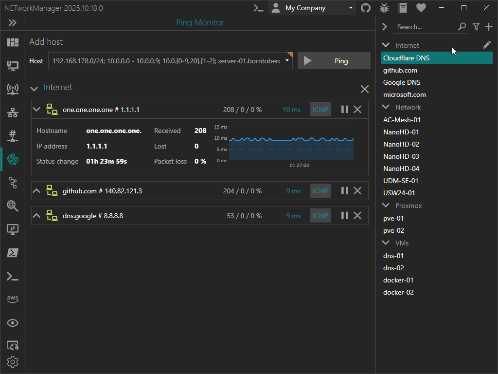

NETworkManager 2025.10.18.0 brings a streamlined approach to profile management with the introduction of Tags and Filtering.

You can now add or remove tags directly within each profile, making it effortless to organize and quickly locate your hosts and networks.

<!-- truncate -->

Easily filter profiles across features using the new filter button next to the search box.

Choose between two filter modes:

- Match All: Display profiles containing all selected tags (e.g., `prod` and `dns`).
- Match Any: Display profiles containing at least one selected tag (e.g., `prod` or `dev`).

Additionally, profile groups are now more manageable. Right-click any group header to access a new context menu, allowing you to expand or collapse all groups with a single click.

These enhancements make managing large profile sets faster, cleaner, and more intuitive than ever.

Upgrade now to the [latest version of NETworkManager](https://borntoberoot.net/NETworkManager/download) to use this feature.

More information is available in the [official documentation](https://borntoberoot.net/NETworkManager/docs/groups-and-profiles).

If you find any issues or have suggestions for improvement, please open an [issue on GitHub](https://github.com/BornToBeRoot/NETworkManager/issues):
