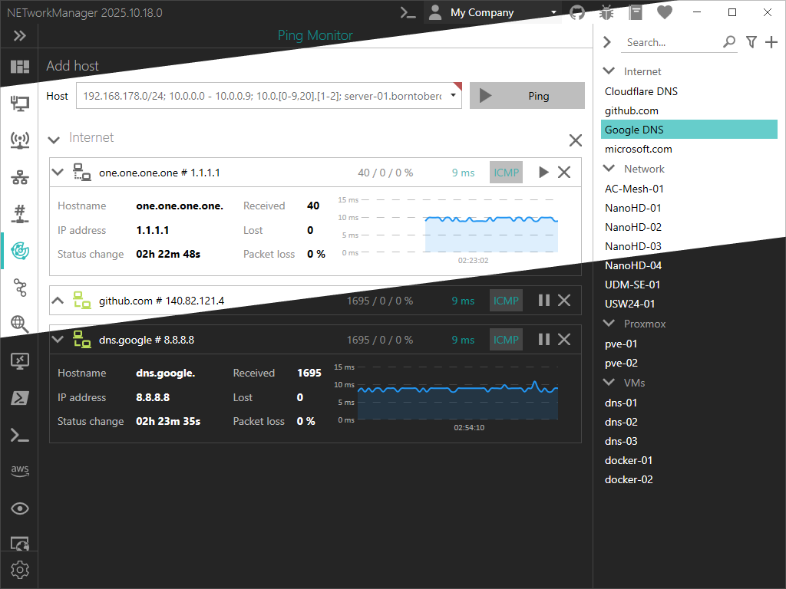

The latest release of NETworkManager (version 2025.10.18.0) introduces major enhancements to the light theme, improving both readability and overall user experience.

In this version, the code that handles theming has been completely rewritten, providing granular control over colors and styles. This allows users to fine-tune the light and dark themes independently, ensuring better contrast, visibility, and accessibility across the interface.

The light theme has already received several improvements to enhance readability, and more adjustments are planned for future releases based on user feedback. So please don’t hesitate to share your thoughts on the [GitHub issue tracker](https://github.com/BornToBeRoot/NETworkManager/issues).

<!-- truncate -->

Upgrade now to the [latest version of NETworkManager](https://borntoberoot.net/NETworkManager/download) to use this feature.

More information is available in the [official documentation](https://borntoberoot.net/NETworkManager/docs/settings/appearance).

If you find any issues or have suggestions for improvement, please open an [issue on GitHub](https://github.com/BornToBeRoot/NETworkManager/issues).
