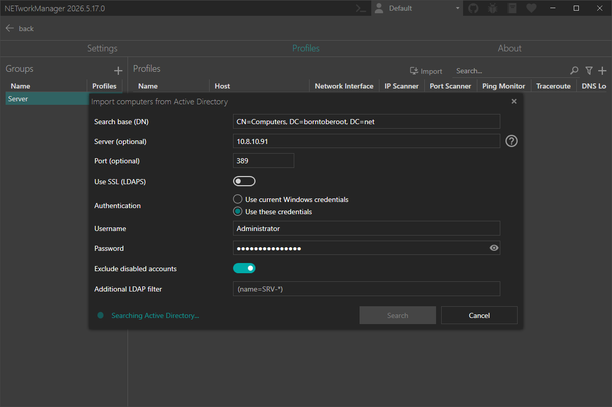

NETworkManager now lets you import profiles directly from **Active Directory**. Instead of creating profiles for every machine by hand, you can query your AD for computer accounts via LDAP, review the results, and bulk-import them into any group with a single click.

<!-- truncate -->

## The problem with large environments

If you manage dozens or hundreds of machines, maintaining NETworkManager profiles manually is tedious. You have to add each host one by one, set the display name, pick the right group, and enable the applications you need. When machines are added or decommissioned in AD, keeping profiles in sync becomes its own maintenance burden.

The new **Active Directory import** solves this by pulling computer accounts directly from your domain.

## How it works

Go to **Settings → Profiles** and click **Import**. Select **Active Directory** as the import source. A dialog opens where you configure the LDAP connection:

| Field | Description |
| --- | --- |
| **Search base** | LDAP search base, e.g. `DC=domain,DC=com` |
| **Server** | Hostname or IP of the LDAP server. Leave empty to use the default domain controller. |
| **Port** | Defaults to `389` (LDAP) or `636` (LDAPS), switches automatically when **Use SSL** is toggled. |
| **Use SSL** | Connect via LDAPS (encrypted). |
| **Authentication** | Use current Windows credentials or supply a custom username and password. |
| **Exclude disabled accounts** | Skip computer accounts that are disabled in AD. |
| **Additional LDAP filter** | Narrow results further, e.g. `(operatingSystem=Windows Server*)`. |

Click **Search** and NETworkManager queries the directory. All matching computer accounts appear in the next step.

## Review and import

Before anything is written, you get a full review of what will be imported:

Each entry shows a **Status** so you know exactly what will happen:

- **New** — not yet in NETworkManager, will be imported.
- **Already imported** — already exists as a profile from this source. Skipped by default (configurable).
- **No host** — no host address available, cannot be imported.

On the right side you choose which **applications** to enable for the imported profiles. [Ping Monitor](https://borntoberoot.net/NETworkManager/docs/application/ping-monitor), [Remote Desktop](https://borntoberoot.net/NETworkManager/docs/application/remote-desktop), and [PowerShell](https://borntoberoot.net/NETworkManager/docs/application/powershell) are pre-selected, but you can change this before importing.

You also pick a **target group** — either an existing one or a new name you type in on the spot.

Click **Import** and a summary shows how many profiles were created, skipped as duplicates, and skipped due to missing host addresses.

## Try it now

You can test this feature in the [latest pre-release of NETworkManager](https://borntoberoot.net/NETworkManager/download#pre-release).

More information is available in the [official documentation](https://borntoberoot.net/NETworkManager/docs/groups-and-profiles#import).

If you find any issues or have suggestions for improvement, please open an [issue on GitHub](https://github.com/BornToBeRoot/NETworkManager/issues).
