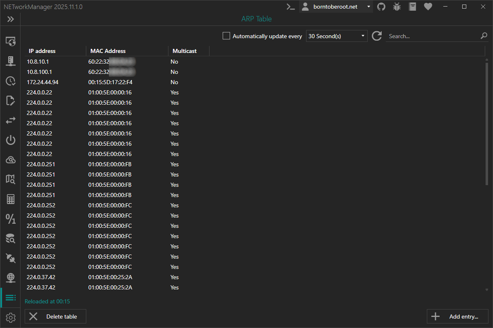
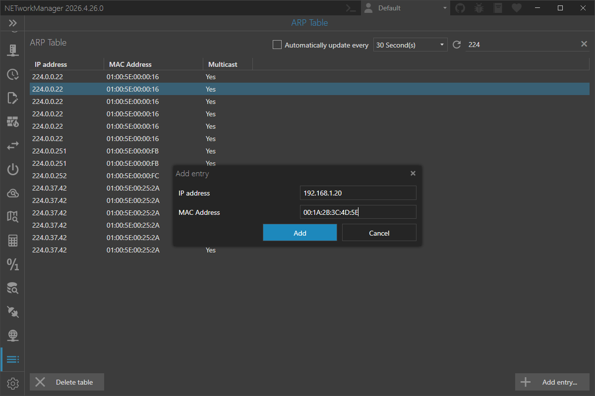

# ARP Table

The **ARP table** shows you the IP address and MAC address of all devices on your network with which the computer has already established a connection.

:::info

ARP (Address Resolution Protocol) is a layer 2 protocol for mapping IP addresses to MAC addresses. The ARP table is a list of all IP addresses and the corresponding MAC addresses of the devices on the network. When a device needs to send data to a specific IP address, it first checks its ARP table to see if it already has the MAC address for that IP address. If the MAC address is not found in the ARP table, the device will send a broadcast message called an ARP request to the network asking which device owns that IP address. The device that owns the IP address will then respond with its MAC address, and the requesting device will update its ARP table with the new mapping. ARP cache poisoning attacks can manipulate the contents of the ARP table, leading to security issues.

:::

:::note

In addition, further actions can be performed using the buttons below:

- **Add entry...** - Opens a dialog to add an entry to the ARP table.
- **Delete table** - Delete all entries from the ARP table.

:::

:::note

With `F5` you can refresh the ARP table.

Right-click on the result to delete an entry, or to copy or export the information.

:::

## Add entry

The **Add entry** dialog is opened by clicking the **Add entry...** button below the table. It creates a new static ARP entry that maps an IP address to a MAC address.

### IP address

IPv4 address of the device.

**Type:** `String`

**Default:** `Empty`

**Example:** `10.0.0.10`

:::note

Only IPv4 addresses are accepted. The field is required and validated for a correct address format.

:::

### MAC address

MAC address of the device the [IP address](#ip-address) should be mapped to.

**Type:** `String`

**Default:** `Empty`

**Example:**

- `00:1A:2B:3C:4D:5E`
- `00-1A-2B-3C-4D-5E`

:::note

The field is required and validated for a correct MAC address format.

:::

:::note

Adding a static ARP entry requires administrator privileges and runs `arp -s` under the hood.

:::
