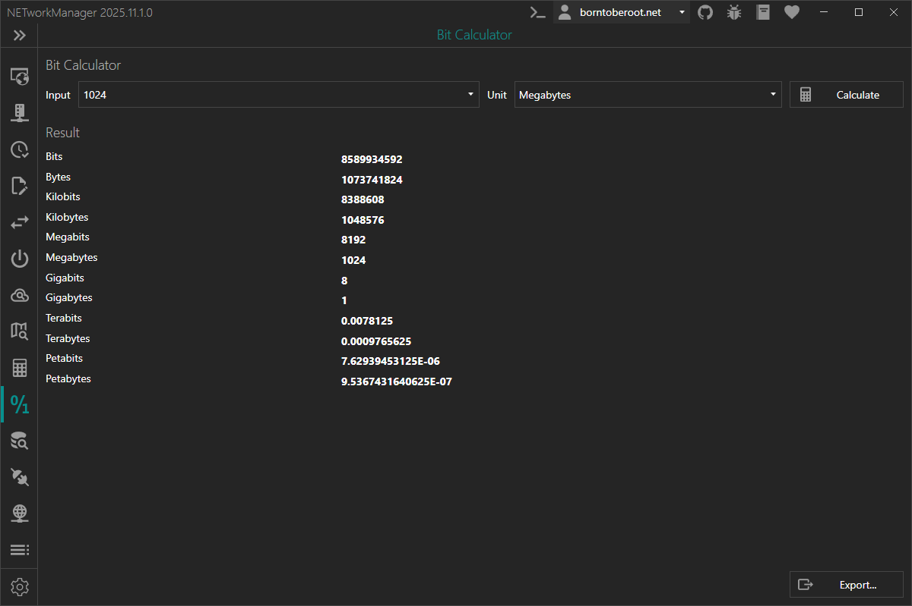

# Bit Calculator

With the **Bit Calculator** different data units can be converted. Based on the input number and the selected unit the different units like bits, bytes, kilobits, kilobytes, megabits, megabytes, etc. are calculated.

:::note

Right-click on the result to copy the information.

:::

## Settings

### Notation

Notation which should be used for the calculation.

**Type:** `NETworkManager.Models.Network.BitCaluclatorNotation`

**Default:** `Binary`

**Possible values:**

- `Binary` (1024)
- `Decimal` (1000)
