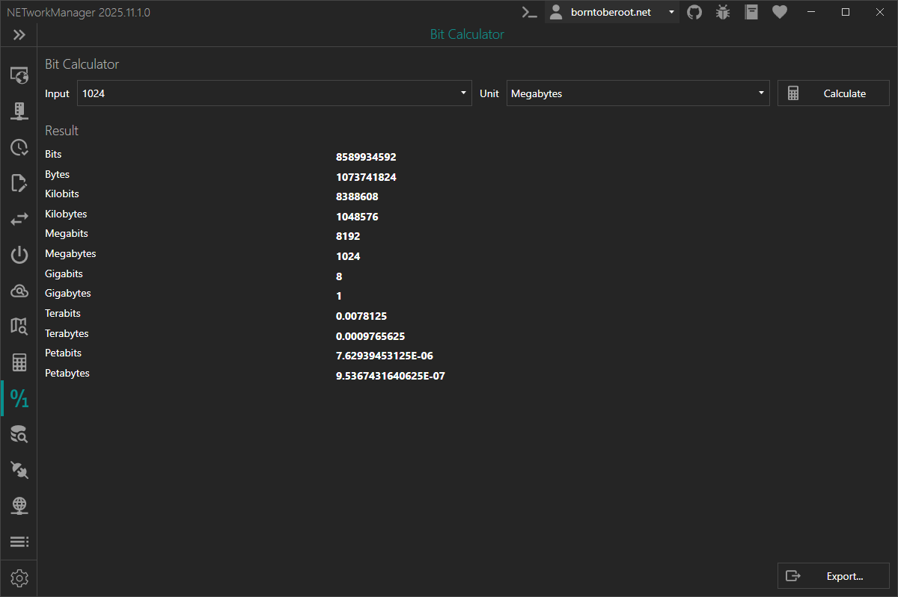

# Bit Calculator

With the **Bit Calculator** you can convert between different data units — enter a number and select the input unit to see the equivalent values in bits, bytes, kilobits, kilobytes, megabits, megabytes, and more.

### Toolbar

| Button | Description |
|--------|-------------|
| **Export...** | Exports the information to a CSV, XML, or JSON file |

### Context menu

| Action | Description |
|--------|-------------|
| **Copy** | Copies the selected information to the clipboard |

## Settings

### Notation

Notation used for the calculation.

**Type:** `NETworkManager.Models.Network.BitCaluclatorNotation`

**Default:** `Binary`

**Possible values:**

- `Binary` (1024)
- `Decimal` (1000)
