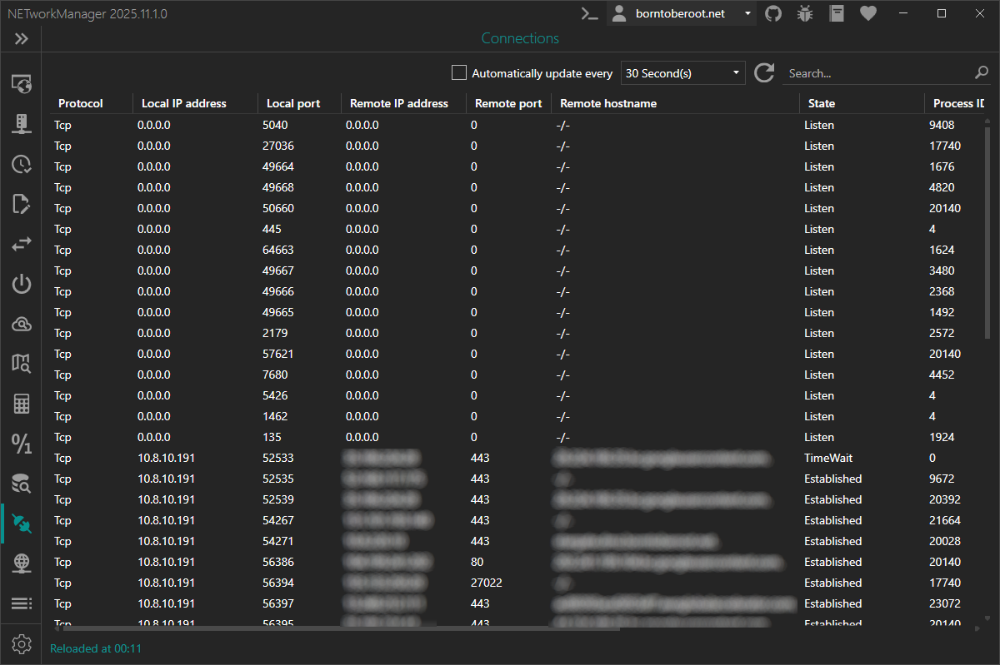

# Connections

The **Connections** view shows all active **TCP** connections with their source and destination IP endpoints (IP address and port) and the associated process running on your computer.

:::info

The data shown is similar to the output of the `netstat` command.

:::

### Context menu

| Action | Description |
|--------|-------------|
| **Copy** | Copies the selected information to the clipboard |
| **Export...** | Exports the selected or all results to a file |

### Keyboard shortcuts

| Key | Action |
|-----|--------|
| `F5` | Refresh |
