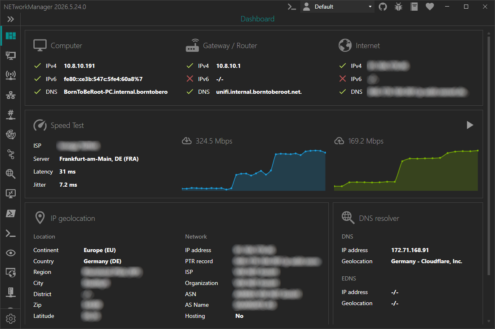

# Dashboard

The **Dashboard** shows the status of your computer's current network connection to provide a quick overview of the most important information. Whenever the local network adapter changes state (e.g. an Ethernet cable is plugged in, Wi-Fi or VPN connects), the dashboard checks connectivity to the router and the internet.

### Keyboard shortcuts

| Key | Action |
|-----|--------|
| `F5` | Refresh the dashboard |

:::note

You may need to click into a widget first before keyboard shortcuts are recognized.

:::

## Settings

### Public IPv4 address

Public IPv4 address reachable via ICMP.

**Type:** `String`

**Default:** `1.1.1.1`

### Public IPv6 address

Public IPv6 address reachable via ICMP.

**Type:** `String`

**Default:** `2606:4700:4700::1111`

### Check public IP address

Enables or disables the resolution of the public IP address via [`api.ipify.org`](https://www.ipify.org/) and [`api6.ipify.org`](https://www.ipify.org/).

**Type:** `Boolean`

**Default:** `Enabled`

### Use custom IPv4 address API

Override the default IPv4 address API to resolve the public IP address. The API should return only a plain text IPv4 address like `xx.xx.xx.xx`.

**Type:** `Boolean | String`

**Default:** `Disabled | Empty`

**Example:**

- [`api.ipify.org`](https://api.ipify.org/)
- [`ip4.seeip.org`](https://ip4.seeip.org/)
- [`api.my-ip.io/ip`](https://api.my-ip.io/ip)

### Use custom IPv6 address API

Override the default IPv6 address API to resolve the public IP address. The API should return only a plain text IPv6 address like `xxxx:xx:xxx::xx`.

**Type:** `Boolean | String`

**Default:** `Disabled | Empty`

**Example:**

- [`api6.ipify.org`](https://api6.ipify.org/)

### Check IP geolocation

Enables or disables the resolution of the IP geolocation via [`ip-api.com`](https://ip-api.com/).

:::note

The free API endpoint is limited to 45 requests per minute, supports only the `http` protocol and is available for non-commercial use only.

:::

**Type:** `Boolean`

**Default:** `Enabled`

### Check DNS resolver

Enables or disables the detection of the DNS resolver in use via [`ip-api.com`](https://ip-api.com/).

**Type:** `Boolean`

**Default:** `Enabled`

## Speed Test

The **Speed Test** widget measures the current connection's download and upload speed, latency, and jitter against [`speed.cloudflare.com`](https://speed.cloudflare.com/). The test is **user-initiated** — it does not run automatically on dashboard load. Click **Speed Test** to run a measurement.

The result includes:

- **Download** speed in Mbps
- **Upload** speed in Mbps
- **Latency** in ms (unloaded, 50th percentile of latency probes)
- **Jitter** in ms (average consecutive delta between latency samples)
- **ISP** — internet service provider as reported by Cloudflare
- **Server location** — Cloudflare PoP (Point of Presence) handling the test

Before running the test, a privacy disclaimer informs the user that `speed.cloudflare.com` will receive requests with the client's IP address and network information. The disclaimer is shown again after restarting the app because acceptance is not currently persisted. See the [Cloudflare privacy policy](https://www.cloudflare.com/privacypolicy/) for details. The widget never contacts Cloudflare's telemetry endpoint (`aim.cloudflare.com/__log`).
