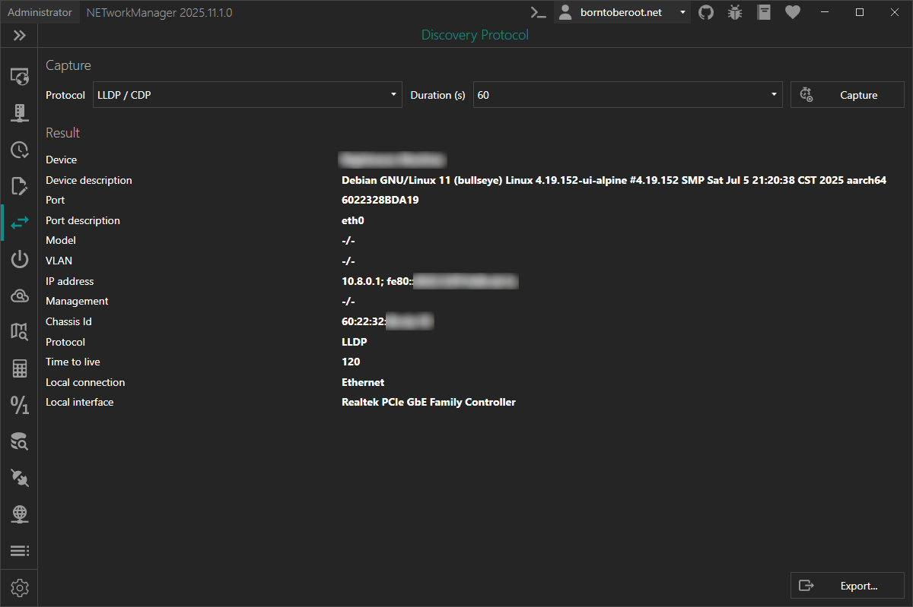

# Discovery Protocol

With **Discovery Protocol** you can capture LLDP (Link Layer Discovery Protocol) and CDP (Cisco Discovery Protocol) frames to see which switch or router your device is connected to. Device name, port, VLAN, and other information are shown in labeled fields.

:::info

The Link Layer Discovery Protocol (LLDP) is a vendor-neutral Layer 2 network protocol used by network devices, especially switches, to advertise their identity, capabilities, and neighbors on an IEEE 802 Local Area Network (LAN). If configured, LLDP messages are sent out periodically as frames with the destination MAC address of `01:80:c2:00:00:0e`. The default time interval is 30 seconds.

The Cisco Discovery Protocol (CDP) is a proprietary Layer 2 protocol used by Cisco Systems to exchange information about network devices. If configured, CDP messages are sent out periodically as frames with the destination MAC address `01:00:0c:cc:cc:cc`. The default time interval is 60 seconds.

:::

:::warning

If you are using a hypervisor like Hyper-V with a virtual switch configured as "External network" which is shared with the host where NETworkManager is running, you may not receive any packets. This is because the virtual switch does not forward the LLDP or CDP frames to the host. You may temporarily change the virtual switch to "Internal network" or "Private network" if you want to use Discovery Protocol to see which switch or router your device is connected to. You can also verify this behavior by using Wireshark.

:::

:::warning[Administrator privileges required]

Without administrator privileges, capturing is not available. Use the **Restart as administrator** button to relaunch the application with elevated rights.

:::

### Toolbar

| Button | Description |
|--------|-------------|
| **Export...** | Exports the information to a CSV, XML, or JSON file |

### Context menu

| Action | Description |
|--------|-------------|
| **Copy** | Copies the selected information to the clipboard |

### Keyboard shortcuts

| Key | Action |
|-----|--------|
| `F5` / `Enter` | Start capturing |
