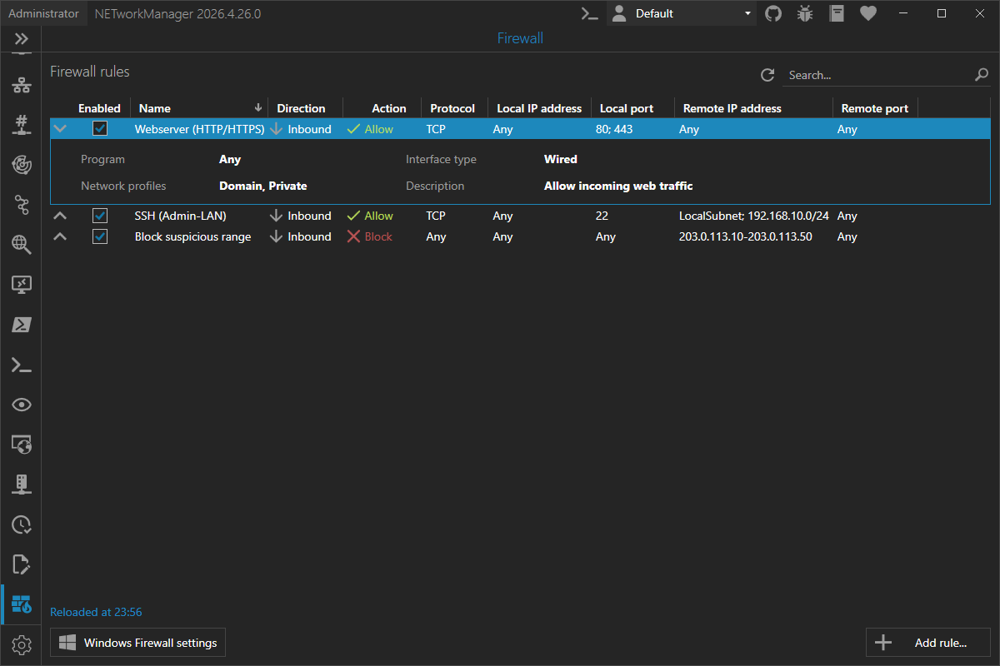
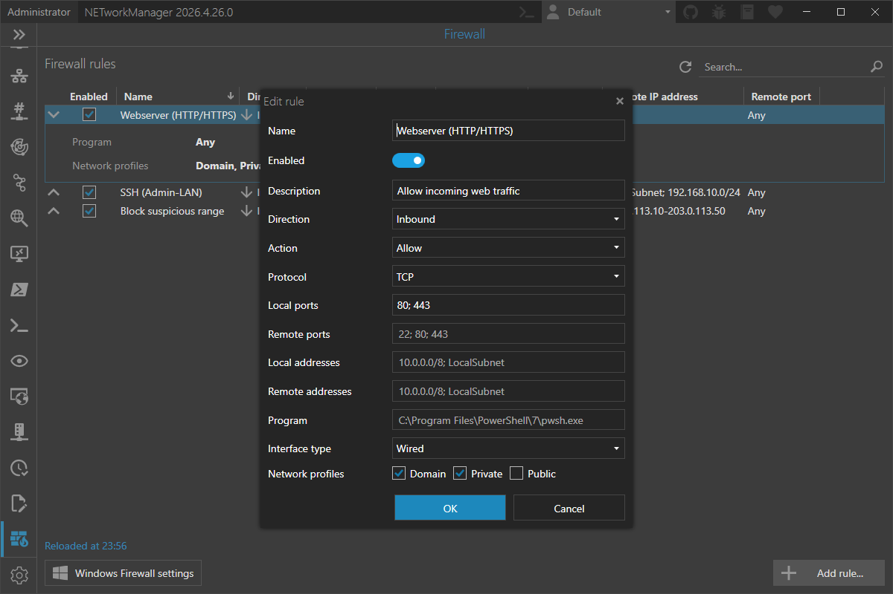

# Firewall

The **Firewall** allows you to view, add, edit, enable, disable, or delete Windows Firewall rules managed by NETworkManager. Rules are identified by a `NETworkManager_` prefix in their display name so that only rules created through NETworkManager are shown in this view.

:::info

Windows Firewall (Windows Defender Firewall) is a built-in host-based firewall included with all versions of Windows. It filters inbound and outbound network traffic based on rules that define the protocol, port, address, program, and action (allow or block).

:::

:::note

Adding, editing, enabling, disabling, or deleting firewall rules requires administrator privileges. If the application is not running as administrator, the view is in read-only mode. Use the **Restart as administrator** button to relaunch the application with elevated rights.

Rules created by NETworkManager use the prefix `NETworkManager_` in their display name to distinguish them from system-managed or third-party rules. Only rules with this prefix are shown in the Firewall view.

:::

:::note

In addition, further actions can be performed using the buttons below:

- **Add rule...** - Opens a dialog to create a new firewall rule.
- **Windows Firewall Settings** - Opens the Windows Firewall management console (`WF.msc`).

:::

:::note

With `F5` you can refresh the firewall rules.

Right-click on a rule to `enable`, `disable`, `edit`, or `delete` it, or to `copy` or `export` the information.

You can also use the Hotkeys `F2` (`edit`) or `Del` (`delete`) on a selected rule.

:::

## Add rule

The **Add rule** dialog is opened by clicking the **Add rule...** button below the rule list. The same dialog (with the values pre-filled) is used to **edit** an existing rule.

The display name of every rule created with NETworkManager is automatically prefixed with `NETworkManager_` so it can be picked up by NETworkManager on the next refresh. The prefix is hidden in the user interface.

### Name

Display name of the firewall rule.

**Type:** `String`

**Default:** `Empty`

**Example:** `Webserver (HTTP/HTTPS)`

:::note

The name is required and must not be empty. Internally the rule is stored with the prefix `NETworkManager_` (e.g. `NETworkManager_Webserver (HTTP/HTTPS)`).

:::

### Enabled

Whether the rule is active right after creation.

**Type:** `Boolean`

**Default:** `Enabled`

### Description

Optional description of the rule.

**Type:** `String`

**Default:** `Empty`

**Example:** `Allow incoming web traffic`

### Direction

Traffic direction the rule applies to.

**Type:** `NETworkManager.Models.Firewall.FirewallRuleDirection`

**Default:** `Inbound`

**Possible values:**

- `Inbound` (Traffic coming into the local computer.)
- `Outbound` (Traffic leaving the local computer.)

### Action

Action that is performed when a packet matches the rule.

**Type:** `NETworkManager.Models.Firewall.FirewallRuleAction`

**Default:** `Allow`

**Possible values:**

- `Allow` (Permit matching traffic.)
- `Block` (Drop matching traffic.)

### Protocol

Network protocol the rule applies to.

**Type:** `NETworkManager.Models.Firewall.FirewallProtocol`

**Default:** `Any`

**Possible values:**

- `Any`
- `TCP`
- `UDP`
- `ICMPv4`
- `ICMPv6`
- `GRE`
- `L2TP`

:::note

[Local ports](#local-ports) and [Remote ports](#remote-ports) are only available when the protocol is set to `TCP` or `UDP`.

:::

### Local ports

One or more local ports or port ranges the rule applies to. Multiple entries are separated by `;`.

**Type:** `String`

**Default:** `Empty`

**Example:**

- `80`
- `80; 443`
- `8080-8090`
- `27015-27030; 27036`

:::note

Only available if [Protocol](#protocol) is set to `TCP` or `UDP`.

An empty value means **Any** port.

:::

### Remote ports

One or more remote ports or port ranges the rule applies to. Multiple entries are separated by `;`.

**Type:** `String`

**Default:** `Empty`

**Example:**

- `53`
- `80; 443`
- `49152-65535`

:::note

Only available if [Protocol](#protocol) is set to `TCP` or `UDP`.

An empty value means **Any** port.

:::

### Local addresses

One or more local addresses the rule applies to. Multiple entries are separated by `;`.

**Type:** `String`

**Default:** `Empty`

**Example:**

- `192.168.1.10`
- `fe80::1`
- `192.168.1.0/24`
- `10.0.0.0/255.0.0.0`
- `192.168.1.10-192.168.1.50`
- `LocalSubnet; 192.168.10.0/24`

:::note

An empty value means **Any** address.

The following formats are accepted:

- Single IPv4 / IPv6 address (e.g. `1.2.3.4`, `fe80::1`)
- IPv4 / IPv6 subnet by prefix length (e.g. `1.2.3.0/24`, `fe80::/48`)
- IPv4 subnet by subnet mask (e.g. `10.0.0.0/255.0.0.0`)
- IPv4 / IPv6 range (e.g. `1.2.3.4-1.2.3.10`, `fe80::1-fe80::9`)
- Keyword: `Any`, `LocalSubnet`, `DNS`, `DHCP`, `WINS`, `DefaultGateway`, `Internet`, `Intranet`, `IntranetRemoteAccess`, `PlayToDevice`, `CaptivePortal`. Keywords can be restricted to IPv4 or IPv6 by appending `4` or `6` (e.g. `LocalSubnet4`, `Intranet6`).

According to Microsoft, the only keyword officially supported by `LocalAddress` is `Any`. The other keywords are intended for use with [Remote addresses](#remote-addresses).

:::

### Remote addresses

One or more remote addresses the rule applies to. Multiple entries are separated by `;`.

**Type:** `String`

**Default:** `Empty`

**Example:**

- `8.8.8.8`
- `10.0.0.0/8`
- `203.0.113.10-203.0.113.50`
- `DNS`
- `Internet; CaptivePortal`

:::note

An empty value means **Any** address.

The same formats as [Local addresses](#local-addresses) are accepted (single address, subnet, range, or keyword).

:::

### Program

Full path to an executable the rule applies to. When set, the rule only matches traffic to or from that program.

**Type:** `String`

**Default:** `Empty`

**Example:** `C:\Program Files\GameServer\server.exe`

:::note

If a path is provided, the file must exist on the local computer.

An empty value means **Any** program.

:::

### Interface type

Network interface type the rule applies to.

**Type:** `NETworkManager.Models.Firewall.FirewallInterfaceType`

**Default:** `Any`

**Possible values:**

- `Any`
- `Wired`
- `Wireless`
- `RemoteAccess`

### Network profiles

Network profiles the rule applies to. At least one profile must be selected.

**Type:** `Boolean[]` (Domain / Private / Public)

**Default:** `Domain`, `Private`, `Public` (all enabled)

**Possible values:**

- `Domain` (Networks at a workplace that are joined to a domain.)
- `Private` (Networks at home or work where you trust the people and devices on the network.)
- `Public` (Networks in public places such as airports or coffee shops.)

:::note

The last enabled profile cannot be unchecked — at least one profile must remain selected.

:::