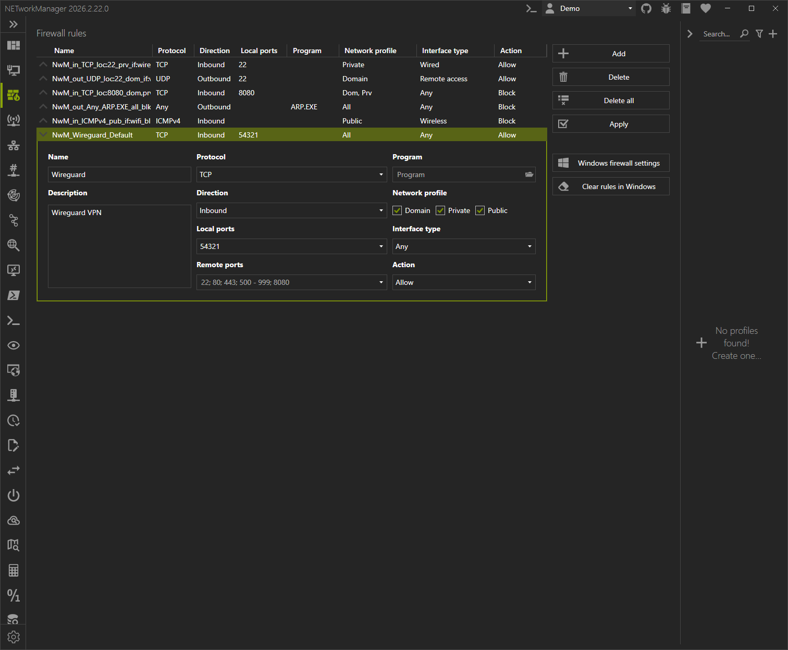
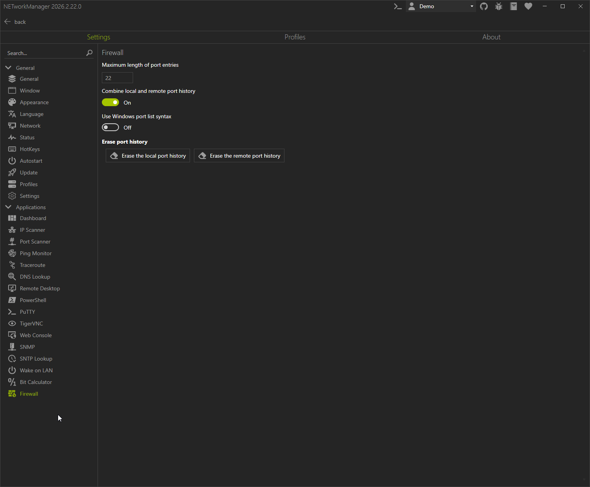
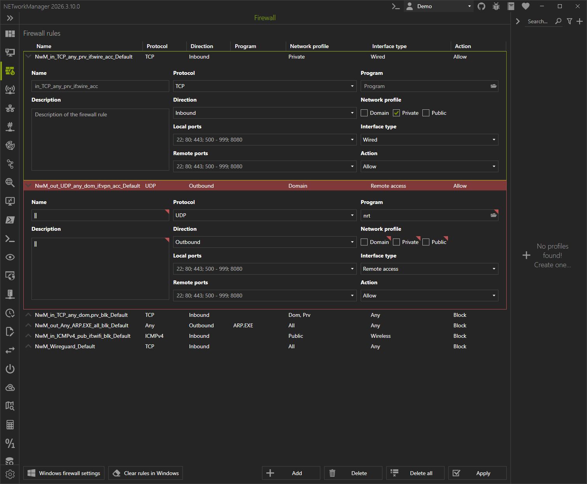

# Firewall #

The **Firewall** allows configuring simple firewall rules in the
Windows Defender firewall. IPsec rules are not supported. You can
configure protocol, local/remote ports/port range, program and
interface type filters as well as the direction, name, description and
action.

## Rule list ##

Rules can be added, deleted or the rule list can be cleared. Rules
stored in the Windows firewall can be cleared separately, however,
applying the rule list also clears the NETworkManager created rules
beforehand. So if the rule list is empty, you can still clear
NETworkManager created rules with the “Clear rules in Windows” button
when desired.

:::note

The columns **Local port**, **Remote port** and **Program** are not
shown if no rule has an entry in that configuration field.

:::

The rule list has both keyboard and mouse control functionality.

### Keyboard control ###

| Hotkey           | Action                                                    |
|:-----------------|:----------------------------------------------------------|
| Ctrl+A           | Apply rules in Windows firewall                           |
| Ctrl+Alt+Shift+C | Delete NETworkManager generated firewall rules in Windows |
| Ctrl+Shift+C     | Delete all rules                                          |
| Ctrl+D or Delete | Delete selected rules or last rule                        |
| Ctrl+N           | Create a new rule                                         |
| Right/Left       | Open/Close details view of the selected rule              |
| Up/Down          | Select the next/previous or last/first rule¹              |
| Ctrl+W           | Open the Windows firewall settings                        |

¹: If no rule is selected, up will select the last rule and down the first one.

:::note

When opening the module or the profile child window tab the focus is
set automatically to the rule grid, such that the hotkeys are
recognized. You can however move it away by using Tab/Shift+Tab. In
that case the Hotkeys will stop working until you click a row or
button again.

:::

### Mouse control ###

| Click                              | Action                                    |
|:-----------------------------------|:------------------------------------------|
| Double click on row                | Open details view                         |
| Double click on details view¹      | Close details view                        |
| Single click on left button on row | Open/Close details view                   |
| Right click                        | Open context menu for the selected rules² |

¹: Double click on any non-interactive part of the details view to
collapse it.
²: The context menu contains the available actions for the selected
rules. They do the same as the buttons in the view.

### Configuration storage ###

The configuration is stored **automatically** when NETworkManager is
closed **regularly**. Regular closing means no crash has happened and
it has not been killed by the task manager or other means to do the
same. If no profile is available the rules will be stored in the
settings file. If a profile is selected, the profile will be modified
immediately when a setting is changed within a rule.

## Settings ##

You can configure a view mostly port related things for this
application.

### Maximum length of port entries ###

Set a limit for the length which local/remote port entries can
have. By default there is no limit. The 22 is just an input example.

**Type:** `Integer`

**Default:** [Int32.MaxValue](https://learn.microsoft.com/en-us/dotnet/api/system.int32.maxvalue)

**Example:** `22`

### Combine local and remote port history ###

This is by default on and combines the entries of the local and remote
port history. The combination happens by alternating between local and
remote port history entries up to the limit, which is configured in
the **General** settings tab. The history is always stored separately,
such that you can freely switch this option.

**Type:** `Boolean`

**Default:** `Enabled`

### Use Windows port list syntax ###

Windows delimits ports and port ranges by a `','` instead of a `';'`
as it is used for instance in the **port scanner** application. You
can choose to use the Windows delimiter here, if you prefer it. This
will replace the history entries and watermarks dynamically, such that
you can switch this option freely.

**Type:** `Boolean`

**Default:** `Disabled`

### Erase port history ###

If you have played around too much with the port entries you have the
option here to erase the local or remote port history. The history
will gradually rebuild its entries when you select existing port
entries, but, as expected, it remains empty if you skip that.

## Rule configuration ##

The rule details view contains the configuration of each rule.

### Name ###

The name setting is an optional field to configure a custom firewall
rule name. It applies to the `DisplayName` field of the rule. A
default name is generated to indicate the rule settings, which is
shown in the empty input field and the name column of the rule. If you
prefer setting a name for the purpose of the rule or for other reasons
you can do this here.

Nevertheless the rule will be comprised of the following:

`NwM_YourChosenName_ProfileNameOrDefault`

The prefix is used to determine NETworkManager generated rules.

**Type:** `String`

**Default:** `Empty`

:::warning

If you have Windows firewall rules with the `NwM_` name (DisplayName)
prefix, be aware, that this module will delete them automatically when
applying rules or when hitting the button, “Delete Windows firewall
rules”. You can check for such rules by running `Get-NetFirewall -DisplayName 'NwM_*'`.

:::

:::note

Characters are limited to 9999 characters excluding the automatic
prefix and suffix and the character `'|'` is not allowed.

:::

### Description ###

You can optionally set a description here.

**Type:** `String`

**Default:** `Empty`
:::note

Characters are limited to 9999 characters and the character `'|'` is
not allowed.

:::

### Protocol ###

This required field specifies, which protocol to apply the rule to. If
the protocol is not **TCP** or **UDP**, you can not set local or
remote port restrictions as it is required by the Windows firewall.

**Type:** `Enum`

**Default:** `TCP`

### Direction ###

Whether to apply the rule for inbound or outbound connections. Required.

**Type:** `Enum`

**Default:** `Inbound`

### Local/Remote ports ###

Restrict for which ports the rule applies when using the **TCP** or
**UDP** protocol. Local ports restrict where the connection happens on
your device. Remote ports restrict the ports, which were used on the
remote device to connect to your network interface.

**Type:** `String`

**Default:** `Empty`

**Example:** `22; 80; 443; 500 - 999; 8080` if Windows port syntax is disabled, `22, 80, 443, 500 - 999, 8080` otherwise.

### Program ###

You can restrict the rule to a specific program here. The file must
have a case insensitive *.exe file extension. Leaving it empty applies
to all programs. The file must exist. If the file is deleted, the rule
will be skipped, because the Windows firewall would then apply the
rule to all programs. The rule and the input field will be marked red
in that case.

**Type:** `String`

**Default:** `Empty`

**Example:** `X:\Path\To\Program.exe`

### Network profile ###

Specifies which network profile the interface should have for the rule
to be applied. You can set multiple profiles. If you deselect all
profiles, the last valid configuration will remain configured and will
be used, when the rule list is applied, because not specifying any
profile would by default be applied to all profiles by the Windows
firewall.

**Type:** `Boolean`

**Default:** `All enabled`

### Interface type ###

You can specify the network interface type which the rule should be
applied to. It is one of:

- Any
- Wired
- Wireless
- Remote Access (virtual VPN devices)

**Type:** `Enum`

**Default:** `Any`

### Action ###

What to do with the connection when the rule filters apply to
it. IPsec actions (Allow when secure) are not supported.

Options are:

- Allow
- Block

**Type:** `Enum`

**Default:** `Block`

## Profiles ##

The current list is automatically inserted in the configuration of new
profiles. You can clear it with the “Delete all” when desired. This
also works when adding profiles in another application.

There are two conditions, which your configuration must meet for
saving:

1. You **must** provide at least one rule. 
2. All rule names **must not** exceed the length limit of 9999
   characters.¹

¹: While it is not possible to enter a custom rule name longer than
(9999 - prefix - suffix), you can provide a long custom rule name and
overflow it with the profile name.

The keyboard and mouse control works is the same as in the main view
except that hotkeys for applying, the Windows firewall and so on are
ignored.
