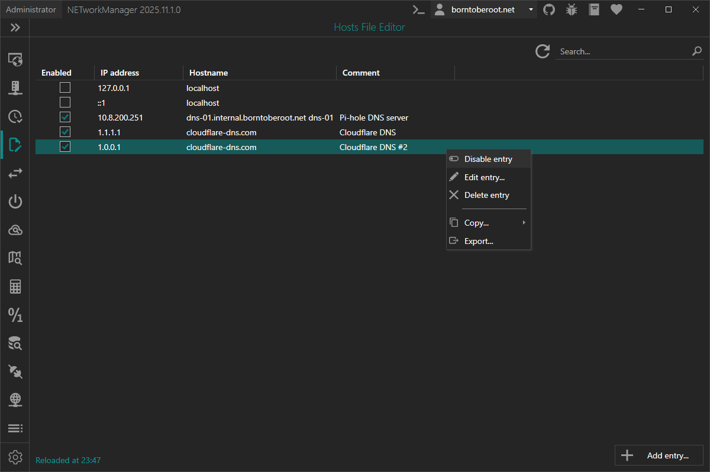

# Hosts File Editor

The **Hosts File Editor** allows you to view, add, edit, enable, disable, or remove entries in the local computer's `hosts` file.

Editing the `hosts` file requires administrator privileges. The application automatically creates a daily backup of the `hosts` file, retaining up to 5 backups in the same directory (Syntax: `hosts_backup_NETworkManager_YYYYMMDD`).

:::info

The hosts file is a plain text file that maps hostnames to IP addresses and is checked by the operating system before querying DNS servers. It's commonly used to override DNS settings for testing websites, redirecting domains, or blocking access to certain sites. On Windows, the file is located at `C:\Windows\System32\drivers\etc\hosts` and requires administrator privileges to edit.

Each line in the hosts file typically contains an IP address followed by one or more hostnames, separated by spaces or tabs. Lines starting with `#` are comments and ignored by the system.

Example of a hosts file entry:

```plain
10.8.0.10 example.borntoberoot.net # Test server not reachable via DNS
```

:::



:::note

In addition, further actions can be performed using the buttons below:

- **Add entry...** - Opens a dialog to add an entry to the hosts file.

:::

:::note

With `F5` you can refresh the hosts file.

Right-click on the result to `enable`, `disable`, `edit` or `delete` an entry, or to `copy` or `export` the information.

You can also use the Hotkeys `F2` (`edit`) or `Del` (`delete`) on a selected entry.

:::
