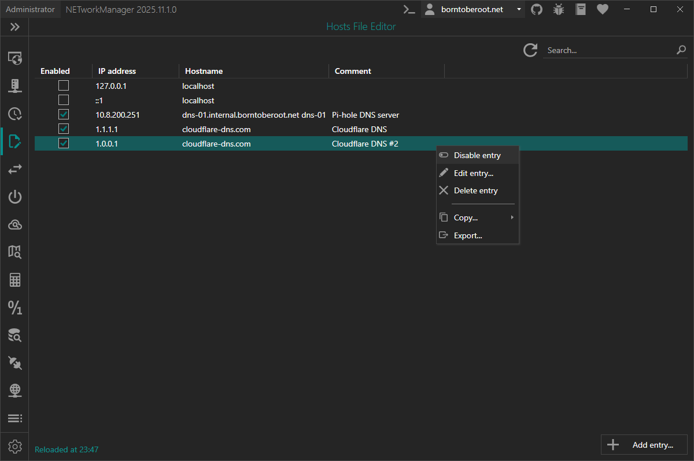
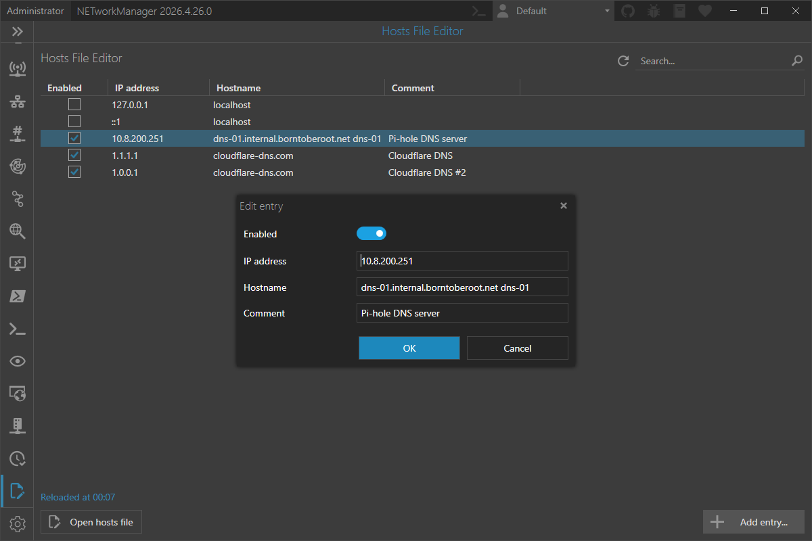

# Hosts File Editor

The **Hosts File Editor** allows you to view, add, edit, enable, disable, or remove entries in the local computer's `hosts` file.

:::info

The hosts file is a plain text file that maps hostnames to IP addresses and is checked by the operating system before querying DNS servers. It's commonly used to override DNS settings for testing websites, redirecting domains, or blocking access to certain sites. On Windows, the file is located at `C:\Windows\System32\drivers\etc\hosts` and requires administrator privileges to edit.

Each line in the hosts file typically contains an IP address followed by one or more hostnames, separated by spaces or tabs. Lines starting with `#` are comments and ignored by the system.

Example of a hosts file entry:

```plain
10.8.0.10 example.borntoberoot.net # Test server not reachable via DNS
```

:::

:::note

Editing the `hosts` file requires administrator privileges. If the application is not running as administrator, the view is in read-only mode. Use the **Restart as administrator** button to relaunch the application with elevated rights.

The application automatically creates a daily backup of the `hosts` file, retaining up to 5 backups in the same directory (Syntax: `hosts_backup_NETworkManager_YYYYMMDD`).

:::



:::note

In addition, further actions can be performed using the buttons below:

- **Add entry...** - Opens a dialog to add an entry to the hosts file.

:::

:::note

With `F5` you can refresh the hosts file.

Right-click on the result to `enable`, `disable`, `edit` or `delete` an entry, or to `copy` or `export` the information.

You can also use the Hotkeys `F2` (`edit`) or `Del` (`delete`) on a selected entry.

:::

## Add entry

The **Add entry** dialog is opened by clicking the **Add entry...** button below the entry list. The same dialog (with the values pre-filled) is used to **edit** an existing entry.



### Enabled

Whether the entry is active right after creation. A disabled entry is written to the `hosts` file as a comment (prefixed with `#`) and is ignored by the operating system.

**Type:** `Boolean`

**Default:** `Enabled`

### IP address

IP address the hostname(s) should resolve to.

**Type:** `String`

**Default:** `Empty`

**Example:**

- `10.8.0.10`
- `fe80::1`

:::note

Both IPv4 and IPv6 addresses are accepted. The field is required and validated for a correct address format.

:::

### Hostname

One or more hostnames that should resolve to the [IP address](#ip-address). Multiple hostnames are separated by a space — matching the native `hosts` file format.

**Type:** `String`

**Default:** `Empty`

**Example:**

- `example.borntoberoot.net`
- `example.borntoberoot.net www.example.borntoberoot.net`

:::note

Each hostname must conform to the standard hostname / domain syntax. The field is required.

:::

### Comment

Optional comment associated with the entry. The comment is written after the hostname(s) on the same line, separated by a `#`.

**Type:** `String`

**Default:** `Empty`

**Example:** `Test server not reachable via DNS`
