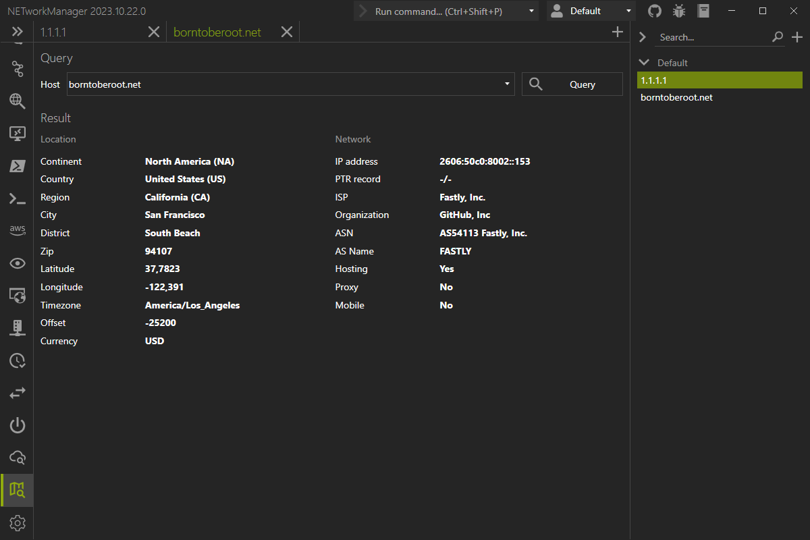

# IP Geolocation

With **IP Geolocation** you can retrieve geolocation information for a fully qualified domain name (FQDN) or a public IP address.

:::info

IP geolocation data is provided by [ip-api.com](https://ip-api.com/) and the API endpoint `http://ip-api.com/json/<host>` is queried when the information is requested.

:::

:::note

The free API endpoint is limited to 45 requests per minute, supports only the `http` protocol and is available for non-commercial use only.

:::

Example inputs:

- `borntoberoot.net`
- `1.1.1.1`

In addition, further actions can be performed using the buttons at the bottom right:

- **Export...** - Export the information to a CSV, XML or JSON file.

:::note

Right-click on the result to copy the information.

:::

## Profile

### Inherit host from general

Inherit the host from the general settings.

**Type:** `Boolean`

**Default:** `Enabled`

:::note

If this option is enabled, the [host](#host) is overwritten by the host from the general settings and the [host](#host) is disabled.

:::

### Host

Host (FQDN or public IP address) to query for IP geolocation information.

**Type:** `String`

**Default:** `Empty`

**Example:**

- `borntoberoot.net`
- `1.1.1.1`
