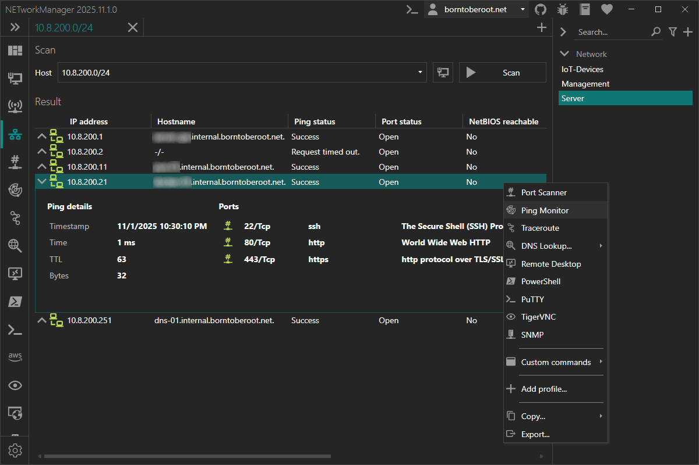

# IP Scanner

With the **IP Scanner** you can scan for active devices based on the hostname or in IP ranges that are reachable via ICMP or have a common TCP port open.

### Example inputs

| Host                             | Description                                                                                  |
| -------------------------------- | -------------------------------------------------------------------------------------------- |
| `10.0.0.1`                       | Single IP address (`10.0.0.1`)                                                               |
| `10.0.0.100 - 10.0.0.199`        | All IP addresses in a given range (`10.0.0.100`, `10.0.0.101`, ..., `10.0.0.199`)            |
| `10.0.0.0/23`                    | All IP addresses in a subnet (`10.0.0.0`, ..., `10.0.1.255`)                                 |
| `10.0.0.0/255.255.254.0`         | All IP addresses in a subnet (`10.0.0.0`, ..., `10.0.1.255`)                                 |
| `10.0.[0-9,20].[1-2]`            | Multiple IP addresses like (`10.0.0.1`, `10.0.0.2`, `10.0.1.1`, ...,`10.0.9.2`, `10.0.20.1`) |
| `borntoberoot.net`               | Single IP address resolved from a host (`10.0.0.1`)                                          |
| `borntoberoot.net/24`            | All IP addresses in a subnet resolved from a host (`10.0.0.0`, ..., `10.0.0.255`)            |
| `borntoberoot.net/255.255.255.0` | All IP addresses in a subnet resolved from a host (`10.0.0.0`, ..., `10.0.0.255`)            |

:::note

Multiple inputs can be combined with a semicolon (`;`).

Example: `10.0.0.0/24; 10.0.[10-20]1`

:::

### Toolbar

| Button                  | Description                                                                                                            |
| ----------------------- | ---------------------------------------------------------------------------------------------------------------------- |
| **Detect local subnet** | Populates the host field with the IP address and subnet mask of the current network interface to scan the local subnet |

:::note

The local IP address (and subnet mask) is determined by trying to route to a public IP address. If this fails (e.g.
no network connection), NETworkManager iterates over active network adapters and selects the first valid IPv4 address,
with link-local addresses (`169.254.x.x`) given lower priority.

:::

### Context menu

Right-clicking a result allows forwarding device information to another tool (e.g. [Port Scanner](./port-scanner), Remote Desktop), creating a new profile, or executing a [custom command](#custom-commands).

| Action        | Description                                      |
| ------------- | ------------------------------------------------ |
| **Copy**      | Copies the selected information to the clipboard |
| **Export...** | Exports the selected or all results to a file    |

## Profile

### Inherit host from general

Inherit the host from the general settings.

**Type:** `Boolean`

**Default:** `Enabled`

:::note

If this option is enabled, the [Host](#host) is overwritten by the host from the general settings and the [Host](#host) is disabled.

:::

### Host

Hostname or IP range to scan for active devices.

**Type:** `String`

**Default:** `Empty`

**Example:**

- `10.0.0.0/24; 10.0.[10-20].1`
- `server-01.borntoberoot.net`

:::note

See also the [IP Scanner](./ip-scanner) example inputs for more information about the supported host formats.

:::

## Settings

### Show unreachable IP addresses and ports

Show the scan result for all IP addresses and ports including the ones that are not active.

**Type:** `Boolean`

**Default:** `Disabled`

### Attempts

Number of times an ICMP request is retried for each IP address if the request has timed out.

**Type:** `Integer` [Min `1`, Max `10`]

**Default:** `2`

### Timeout (ms)

Timeout in milliseconds for each ICMP request, after which the packet is considered lost.

**Type:** `Integer` [Min `100`, Max `15000`]

**Default:** `4000`

### Buffer

Size of the buffer for each ICMP request in bytes.

**Type:** `Integer` [Min `1`, Max `65535`]

**Default:** `32`

### Resolve hostname

Resolve the hostname (PTR) for each IP address.

**Type:** `Boolean`

**Default:** `Enabled`

### Scan ports

Scan each IP address for open TCP ports.

**Type:** `Boolean`

**Default:** `Enabled`

### Ports

List of TCP ports to scan for each IP address.

**Type:** `String`

**Default:** `22; 53; 80; 139; 389; 636; 443; 445; 3389`

:::note

Multiple ports and port ranges can be combined with a semicolon (e.g. `22; 80; 443`). Only common and known ports should be scanned to check if a host is reachable. Use the [Port Scanner](./port-scanner) for a detailed port scan.

:::

### Timeout (ms)

Timeout in milliseconds after which a port is considered closed / timed out.

**Type:** `Integer` [Min `100`, Max `15000`]

**Default:** `4000`

### Scan for NetBIOS

Scan each IP address for NetBIOS information.

**Type:** `Boolean`

**Default:** `Enabled`

### Timeout (ms)

Timeout in milliseconds after which a NetBIOS request is considered lost.

**Type:** `Integer` [Min `100`, Max `15000`]

**Default:** `4000`

### Resolve MAC address and vendor

Resolve the MAC address and vendor for each IP address.

**Type:** `Boolean`

**Default:** `Enabled`

:::note

The MAC address is resolved via ARP (IPv4) or NDP (IPv6) from the neighbor cache. If no entry is found there, NetBIOS is used as a fallback. Because ARP and NDP are link-layer protocols, the device must be in the same subnet as the local machine.

:::

### Custom commands

Custom commands that can be executed with a right click on the selected result.

**Type:** `List<NETworkManager.Utilities.CustomCommandInfo>`

**Default:**

| Name                  | File path      | Arguments                                        |
| --------------------- | -------------- | ------------------------------------------------ |
| Edge                  | `cmd.exe`      | `/c start microsoft-edge:http://$$ipaddress$$/`  |
| Edge (https)          | `cmd.exe`      | `/c start microsoft-edge:https://$$ipaddress$$/` |
| Windows Explorer (c$) | `explorer.exe` | `\\$$ipaddress$$\c$`                             |

In the arguments you can use the following placeholders:

| Placeholder     | Description |
| --------------- | ----------- |
| `$$ipaddress$$` | IP address  |
| `$$hostname$$`  | Hostname    |

:::note

Right-click on a selected custom command to `edit` or `delete` it.

You can also use the Hotkeys `F2` (`edit`) or `Del` (`delete`) on a selected custom command.

:::

### Max. concurrent host threads

Maximum number of threads used to scan for active hosts (1 thread = 1 host / IP address).

**Type:** `Integer` [Min `1`, Max `512`]

**Default:** `256`

:::warning

Too many simultaneous requests may be blocked by a firewall. You can reduce the number of threads to avoid this, but this will increase the scan time.

Too many threads can also cause performance problems on the device.

:::

:::note

This setting only changes the maximum number of concurrently executed threads per host scan. See also the [General](../settings/general#threadpool-additional-min-threads) settings to configure the application-wide thread pool.

:::

### Max. concurrent port threads

Maximum number of threads that are used to scan for open ports for each host (IP address).

**Type:** `Integer` [Min `1`, Max `10`]

**Default:** `5`

:::warning

Too many simultaneous requests may be blocked by a firewall. You can reduce the number of threads to avoid this, but this will increase the scan time.

Too many threads can also cause performance problems on the device.

:::

:::note

This setting only changes the maximum number of concurrently executed threads per port scan. See also the [General](../settings/general#threadpool-additional-min-threads) settings to configure the application-wide thread pool.

:::
