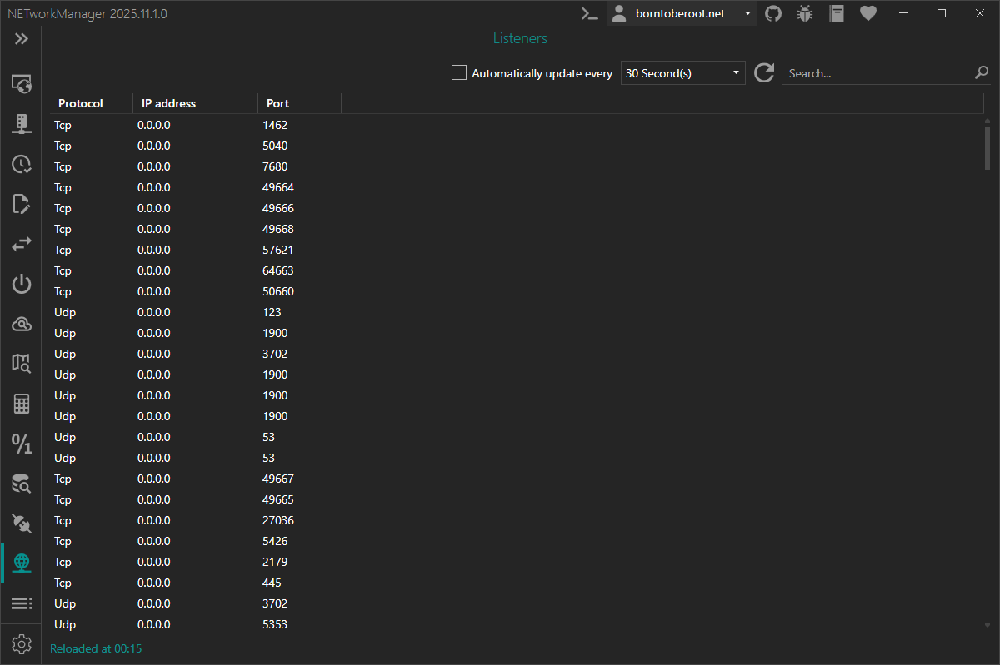

# Listeners

The **Listeners** view shows all active network listeners with their bound IP addresses and ports that are currently running on your computer.

:::info

A network listener is a socket bound to a specific local IP address and port that waits to receive incoming data or connections. TCP listeners accept incoming connections; UDP listeners receive datagrams. Applications use listeners to offer services over a network.

:::

### Context menu

| Action | Description |
|--------|-------------|
| **Copy** | Copies the selected information to the clipboard |
| **Export...** | Exports the selected or all results to a file |

### Keyboard shortcuts

| Key | Action |
|-----|--------|
| `F5` | Refresh |
