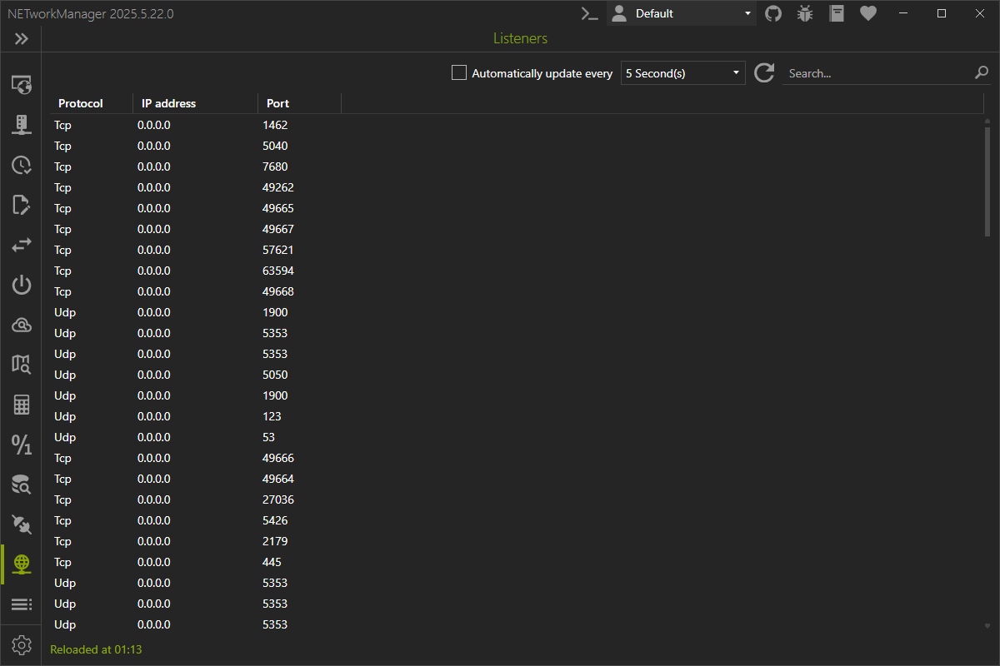

# Listeners

In **Listeners** you can see all the listeners with IP addresses and port that are currently running on your computer.

:::note

Right-click on the result to copy or export the information.

:::
