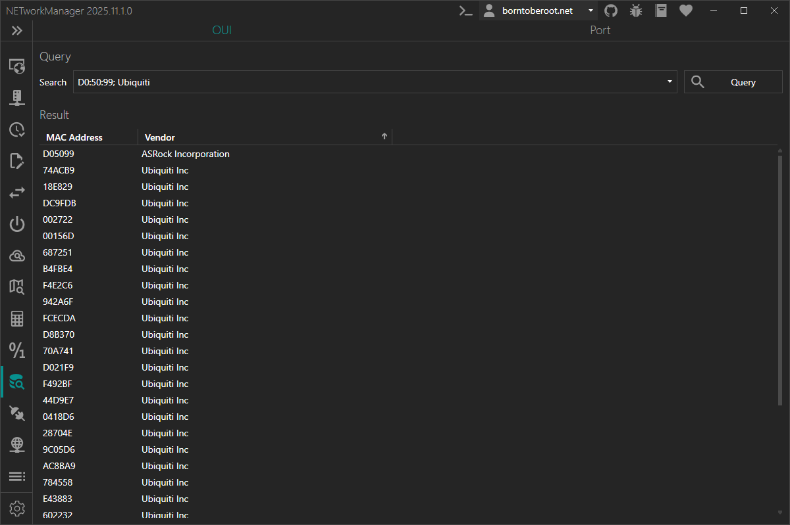
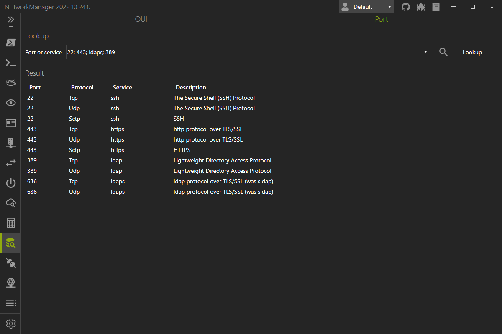

# Lookup

In **Lookup** you can search for information about [OUIs](#oui) (Organizationally Unique Identifiers) and [ports](#port).

## OUI

On the **OUI** tab, you can search the manufacturer of a network interface card (NIC) by entering the first 24 bits of the MAC address. You can also search by vendor name to get all registered MAC addresses of the vendor.

:::info

The OUI (Organizationally Unique Identifier) is a 24-bit number that is assigned to a network interface card (NIC) by the IEEE Registration Authority. The OUI is used to identify the manufacturer of a network interface card. The OUI is the first 24 bits of the MAC address.

:::

:::note

Right-click on the result to copy or export the information.

:::

## Port

On the **Port** tab, you can search for a port number to get information about the service and the protocol used by the port. You can also search by service name to get all registered port numbers of the service.

:::info

A port is a logical construct that identifies a specific process to which network traffic is to be forwarded. Ports are identified by a 16-bit number, known as a port number. Port numbers range from 0 to 65535, but only ports numbers 0 to 1023 are designated as well-known ports. Well-known ports are those registered with IANA for common services such as HTTP (port 80), HTTPS (port 443), FTP (port 21), and SSH (port 22).

:::

:::note

Right-click on the result to copy or export the information.

:::
