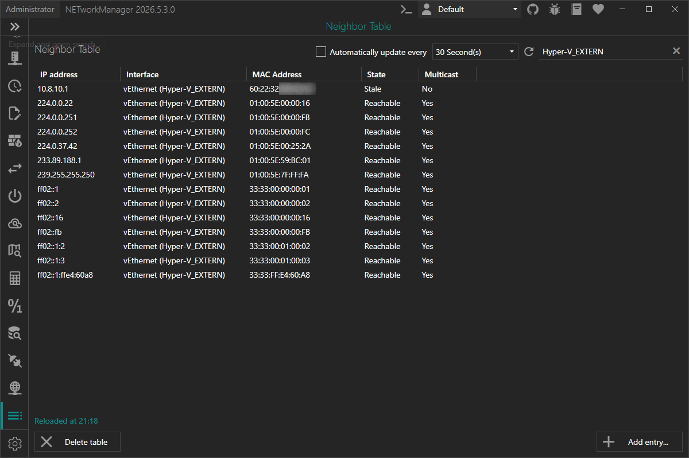

# Neighbor Table

The **Neighbor Table** shows the IP-to-MAC address mappings that the operating system has cached for both IPv4 (ARP) and IPv6 (NDP). It lists all devices on the local network with which the computer has recently communicated.

:::info

**IPv4 – ARP (Address Resolution Protocol)** is a layer-2 protocol that maps IPv4 addresses to MAC addresses. When a device needs to send data to an IPv4 address, it first checks the ARP cache. If no entry is found it broadcasts an ARP request; the target replies with its MAC address and the entry is added to the cache.

**IPv6 – NDP (Neighbor Discovery Protocol)** fulfills the same purpose for IPv6. Instead of broadcasts, NDP uses ICMPv6 Neighbor Solicitation and Advertisement messages sent to a solicited-node multicast address.

Both protocols are susceptible to spoofing/poisoning attacks that can manipulate the cached mappings, which can lead to man-in-the-middle scenarios.

:::

:::note

Adding and deleting neighbor entries requires administrator privileges. If the application is not running as administrator, the view is in read-only mode. Use the **Restart as administrator** button to relaunch the application with elevated rights.

:::

:::note

Additional actions are available via the buttons below the table:

- **Add entry...** – Opens a dialog to add a permanent static neighbor entry.
- **Delete table** – Removes all dynamic entries (permanent entries are preserved).

:::

:::note

Press `F5` to refresh the neighbor table.

Right-click on a row to copy or export individual values, or to delete the selected entry.

:::

## Columns

| Column | Description |
| --- | --- |
| **IP Address** | IPv4 or IPv6 address of the cached neighbor. |
| **Interface** | Human-readable name of the network interface the entry belongs to (e.g. `Ethernet`, `Wi-Fi`). |
| **MAC Address** | Link-layer (MAC) address associated with the IP address. |
| **State** | Current reachability state of the entry (see [States](#states) below). |
| **Multicast** | Indicates whether the IP address is a multicast address. |

## States

| State | Description |
| --- | --- |
| `Unreachable` | The neighbor is no longer reachable and the entry is about to be removed. |
| `Incomplete` | An ARP/NDP request has been sent but no reply has been received yet. |
| `Probe` | The system is actively probing the neighbor to verify reachability. |
| `Delay` | Waiting for an upper-layer protocol to confirm reachability before sending a probe. |
| `Stale` | The entry exists but has not been recently confirmed; will be verified on next use. |
| `Reachable` | The neighbor has been confirmed reachable within the last reachability timeout. |
| `Permanent` | A static entry that was manually added and will not expire. |

## Add entry

The **Add entry** dialog opens by clicking the **Add entry...** button. It creates a new permanent static neighbor entry that maps an IP address to a MAC address.

### IP address

IPv4 or IPv6 address of the device.

**Type:** `String`

**Default:** `Empty`

**Example:** `10.0.0.10`, `2001:db8::1`

:::note

Both IPv4 and IPv6 addresses are accepted. The field is required and validated for the correct address format.

:::

### MAC address

MAC address of the device the [IP address](#ip-address) should be mapped to.

**Type:** `String`

**Default:** `Empty`

**Example:**

- `00:1A:2B:3C:4D:5E`
- `00-1A-2B-3C-4D-5E`

:::note

The field is required and validated for a correct MAC address format.

:::

### Interface

The network interface on which the entry is created.

**Type:** `Dropdown`

**Default:** Last used interface, or the first available interface.

:::note

Adding a static entry requires administrator privileges. Internally, NETworkManager uses `New-NetNeighbor` (PowerShell `NetTCPIP` module) to create the entry with state `Permanent`.

:::