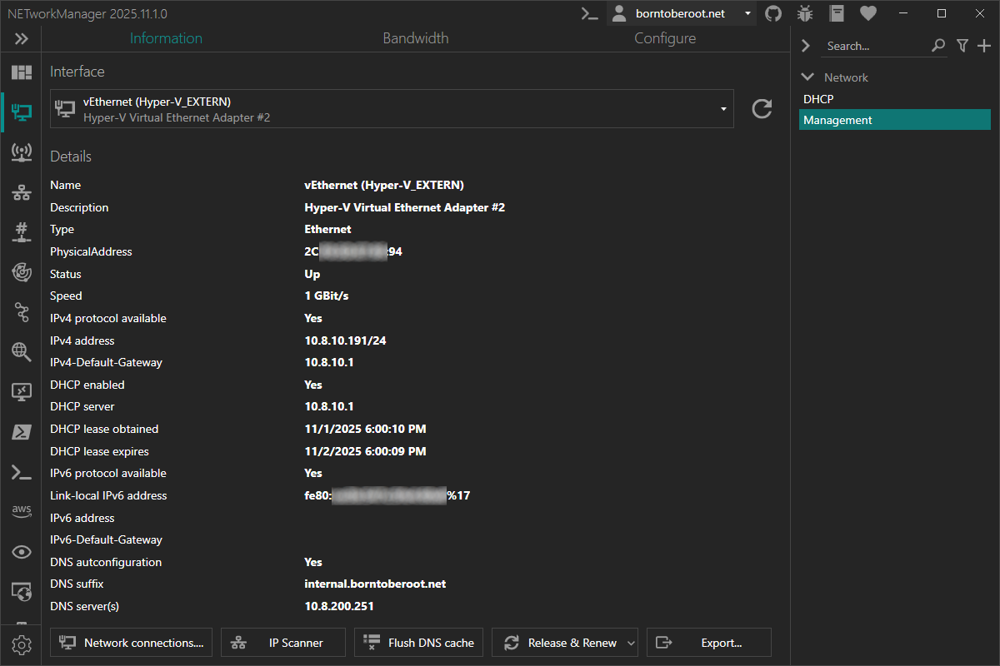
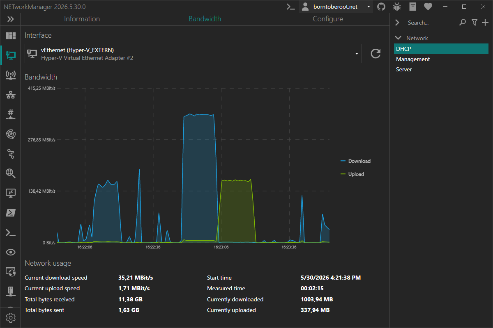
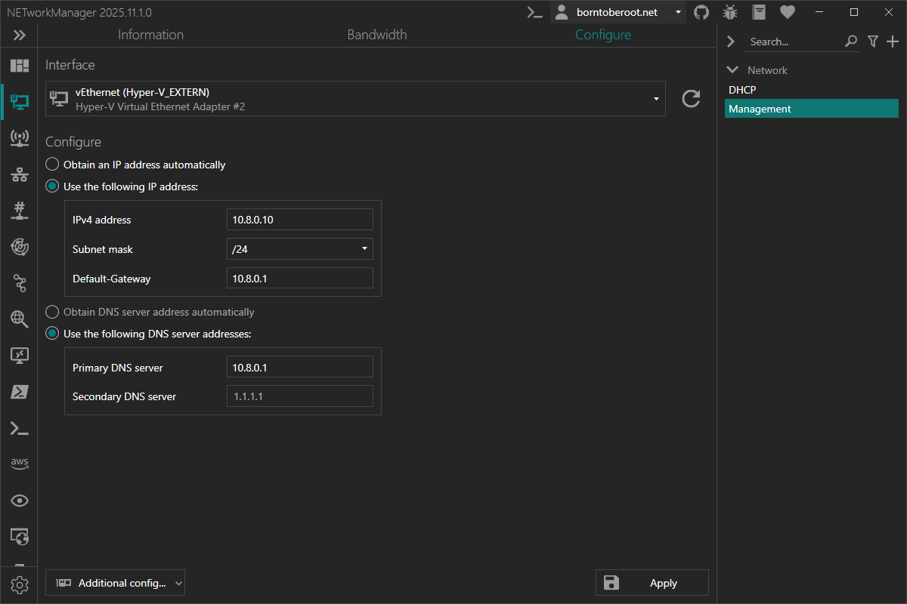

# Network Interface

The **Network Interface** shows all network adapters on the computer with their most important information, such as IP addresses and DNS servers. It also lets you monitor bandwidth usage for connected adapters and configure settings such as IP addresses and DNS servers using profiles.

## Information

On the **Information** tab, you can see all the important details of the selected network adapter such as the configured IP addresses, DNS servers, MAC address, and more. If information such as IPv6 configuration is not available, it is hidden in the view.



### Toolbar

The following buttons are available at the bottom left:

| Button                                       | Description                                                                                                                              |
| -------------------------------------------- | ---------------------------------------------------------------------------------------------------------------------------------------- |
| **Network connections...**                   | Opens the `Control Panel > Network and Internet > Network Connections` window                                                            |
| **IP Scanner**                               | Opens the [IP Scanner](./ip-scanner) with the IPv4 address and subnet mask of the selected adapter                                       |
| **Flush DNS cache**                          | Flushes the DNS cache (`ipconfig /flushdns`)                                                                                             |
| **Release & Renew > IPv4 > Release & Renew** | Releases and renews the IPv4 addresses obtained via DHCP for the selected adapter (`ipconfig /release && ipconfig /renew <ADAPTER>`)     |
| **Release & Renew > IPv4 > Release**         | Releases the IPv4 addresses obtained via DHCP for the selected adapter (`ipconfig /release <ADAPTER>`)                                   |
| **Release & Renew > IPv4 > Renew**           | Renews the IPv4 address via DHCP for the selected adapter (`ipconfig /renew <ADAPTER>`)                                                  |
| **Release & Renew > IPv6 > Release & Renew** | Releases and renews the IPv6 addresses obtained via DHCPv6 for the selected adapter (`ipconfig /release6 && ipconfig /renew6 <ADAPTER>`) |
| **Release & Renew > IPv6 > Release**         | Releases the IPv6 addresses obtained via DHCPv6 for the selected adapter (`ipconfig /release6 <ADAPTER>`)                                |
| **Release & Renew > IPv6 > Renew**           | Renews the IPv6 address via DHCPv6 for the selected adapter (`ipconfig /renew6 <ADAPTER>`)                                               |
| **Export...**                                | Exports the information to a CSV, XML, or JSON file                                                                                      |

### Context menu

| Action   | Description                                      |
| -------- | ------------------------------------------------ |
| **Copy** | Copies the selected information to the clipboard |

## Bandwidth

On the **Bandwidth** tab, you can monitor the currently used bandwidth of the selected network adapter.

The current download and upload speed is displayed in bit/s (B/s) and automatically scales to KBit/s (KB/s), MBit/s (MB/s), or GBit/s (GB/s) depending on the bandwidth in use. The view also shows when the measurement started and the total amount downloaded and uploaded since then.



:::note

If you switch to another tool, monitoring stops and the statistics are reset when you switch back.

:::

## Configure

On the **Configure** tab, you can change the configuration of the selected network adapter. In order to change the settings, the network adapter must be connected.

The options you can set correspond to the network adapter properties `Internetprotokoll, Version 4 (TCP/IPv4) Properties` in the `Control Panel > Network and Internet > Network Connections`. These are explained in the [profiles section](#profile).



### Toolbar

| Button                                            | Description                                                                              |
| ------------------------------------------------- | ---------------------------------------------------------------------------------------- |
| **Apply**                                         | Applies the configuration by launching an elevated PowerShell                            |
| **Additional config... > Add IPv4 address...**    | Opens a dialog to add an IPv4 address with a subnet mask or CIDR to the selected adapter |
| **Additional config... > Remove IPv4 address...** | Opens a dialog to remove an IPv4 address from the selected adapter                       |

:::note

You may need to confirm a Windows UAC dialog to make changes to the network interface.

:::

:::note

**Add IPv4 address:** If a static IP address is added to a network adapter that is configured for DHCP, the `netsh` option `dhcpstaticipcoexistence` is also activated.

The following command is executed in an elevated PowerShell to enable the `dhcpstaticipcoexistence` option:

```powershell
netsh interface ipv4 set interface interface="Ethernet" dhcpstaticipcoexistence=enabled
```

:::

:::info

The `netsh` option `dhcpstaticipcoexistence` allows the network adapter to use a static IP address and still receive DHCP options (e.g. DNS server) from the DHCP server. This is useful if you want to use a static IP address but still want to receive DNS server addresses from the DHCP server. This feature is available since Windows 10 version 1703 (Creators Update).

:::

:::note

**Remove IPv4 address:** Only IPv4 addresses that are not assigned via DHCP can be removed.

If you have previously added an additional IPv4 address to a network adapter that is configured for DHCP, the `netsh` option `dhcpstaticipcoexistence` remains active. To disable it, run the following command in an elevated PowerShell:

```powershell
netsh interface ipv4 set interface interface="Ethernet" dhcpstaticipcoexistence=disabled
```

:::

## Profile

### Obtain an IP address automatically

Obtain an IP address automatically from a DHCP server for the selected network adapter.

**Type:** `Boolean`

**Default:** `Enabled`

:::note

If you select this option, the [Use the following IP address](#use-the-following-ip-address) option will be disabled.

:::

### Use the following IP address:

Configure a static IP address for the selected network adapter. See [IPv4 address](#ipv4-address), [Subnetmask or CIDR](#subnetmask-or-cidr) and [Default-Gateway](#default-gateway) options below for more information.

**Type:** `Boolean`

**Default:** `Disabled`

:::note

If you select this option, the [Obtain an IP address automatically](#obtain-an-ip-address-automatically) option will be disabled.

:::

### IPv4 address

Static IPv4 address for the selected network adapter.

**Type:** `String`

**Default:** `Empty`

**Example:** `192.168.178.20`

### Subnetmask or CIDR

Subnet mask or CIDR for the selected network adapter.

**Type:** `String`

**Default:** `Empty`

**Example:**

- `/24`
- `255.255.255.0`

### Default-Gateway

Default gateway for the selected network adapter.

**Type:** `String`

**Default:** `Empty`

**Example:** `192.168.178.1`

### Obtain DNS server address automatically

Obtain DNS server address automatically from a DHCP server for the selected network adapter.

**Type:** `Boolean`

**Default:** `Enabled`

:::note

If you select this option, the [Use the following DNS server addresses](#use-the-following-dns-server-addresses) option will be disabled.

:::

### Use the following DNS server addresses:

Configure static DNS server addresses for the selected network adapter. See [Primary DNS server](#primary-dns-server) and [Secondary DNS server](#secondary-dns-server) options below for more information.

**Type:** `Boolean`

**Default:** `Disabled`

:::note

If you select this option, the [Obtain DNS server address automatically](#obtain-dns-server-address-automatically) option will be disabled.

:::

### Primary DNS server

Primary DNS server for the selected network adapter.

**Type:** `String`

**Default:** `Empty`

**Example:** `1.1.1.1`

### Secondary DNS server

Secondary DNS server for the selected network adapter.

**Type:** `String`

**Default:** `Empty`

**Example:** `1.0.0.1`
