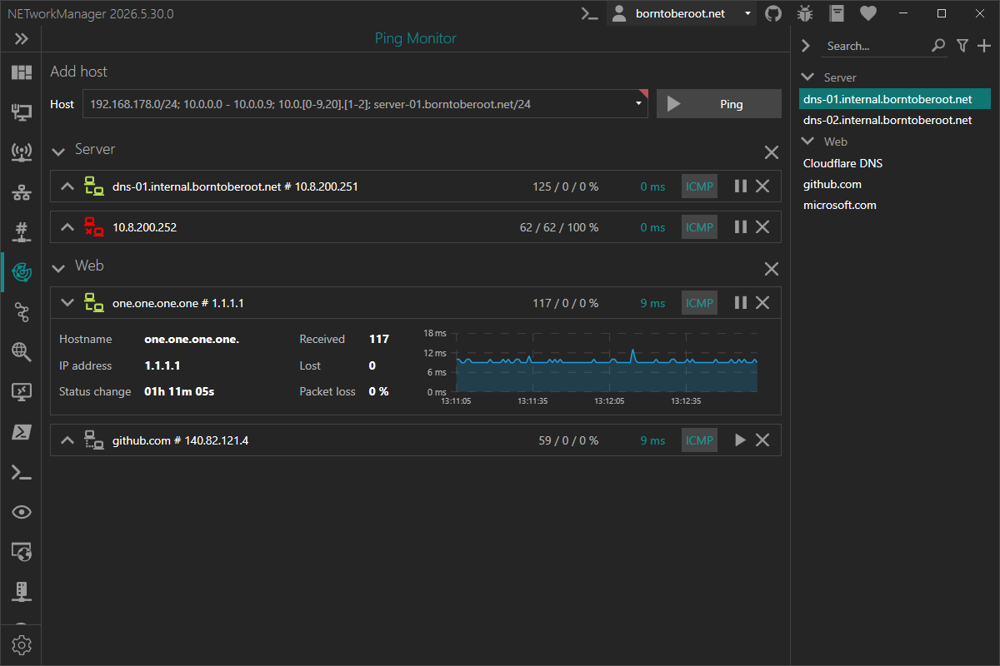

# Ping Monitor

With the **Ping Monitor** you can monitor one or multiple hosts with ICMP echo requests to determine whether each host is reachable.

:::info

ICMP (Internet Control Message Protocol) is a network-layer protocol used to send diagnostic and control messages. An ICMP echo request (commonly known as a ping) asks a remote host to send back an echo reply, confirming it is reachable on the network.

:::

### Example inputs

| Host                             | Description                                                                                |
| -------------------------------- | ------------------------------------------------------------------------------------------ |
| `10.0.0.1`                       | Single IP address (`10.0.0.1`)                                                             |
| `10.0.0.100 - 10.0.0.199`        | All IP addresses in a given range (`10.0.0.100`, `10.0.0.101`, ..., `10.0.0.199`)          |
| `10.0.0.0/23`                    | All IP addresses in a subnet (`10.0.0.0`, ..., `10.0.1.255`)                               |
| `10.0.0.0/255.255.254.0`         | All IP addresses in a subnet (`10.0.0.0`, ..., `10.0.1.255`)                               |
| `10.0.[0-9,20].[1-2]`            | Multiple IP addresses like (`10.0.0.1`, `10.0.0.2`, `10.0.1.1`, ...,`10.0.9.2`, `10.0.20.1`) |
| `borntoberoot.net`               | Single IP address resolved from a host (`10.0.0.1`)                                        |
| `borntoberoot.net/24`            | All IP addresses in a subnet resolved from a host (`10.0.0.0`, ..., `10.0.0.255`)          |
| `borntoberoot.net/255.255.255.0` | All IP addresses in a subnet resolved from a host (`10.0.0.0`, ..., `10.0.0.255`)          |

:::note

Multiple inputs can be combined with a semicolon (`;`).

Example: `10.0.0.0/24; 10.0.[10-20]1`

:::

### Chart

Each monitored host shows a latency chart over time. By default the chart displays the last 2 minutes (see [Chart time (seconds)](#chart-time-seconds)) and scrolls automatically as new results arrive (**live mode**).

You can interact with the chart to inspect past results:

| Action | Description |
|--------|-------------|
| **Mouse wheel** | Zoom in and out on the time axis |
| **Left mouse button + drag** | Pan the chart left and right |
| **Right mouse button + drag** | Zoom into the selected section |

When you zoom or pan, the chart leaves live mode and stops scrolling. A **Live** button then appears in the top-right corner of the chart — click it to return to live mode and resume auto-scrolling.

### Context menu

Right-click a monitored host (anywhere except the chart) to open the context menu:

| Action | Description |
|--------|-------------|
| **Export...** | Exports the results of the host to a file |

Right-clicking an individual field (hostname, IP address, ...) instead lets you **Copy** its value to the clipboard.

## Profile

### Inherit host from general

Inherit the host from the general settings.

**Type:** `Boolean`

**Default:** `Enabled`

:::note

If this option is enabled, the [Host](#host) is overwritten by the host from the general settings and the [Host](#host) is disabled.

:::

### Host

Hostname or IP address to ping.

**Type:** `String`

**Default:** `Empty`

**Example:**

- `server-01.borntoberoot.net`
- `1.1.1.1`

## Settings

### Timeout (ms)

Timeout in milliseconds for each ICMP packet, after which the packet is considered lost.

**Type:** `Integer` [Min `100`, Max `15000`]

**Default:** `4000`

### Buffer

Buffer size of the ICMP packet.

**Type:** `Integer` [Min `1`, Max `65535`]

**Default:** `32`

### TTL

Time to live of the ICMP packet.

**Type:** `Integer` [Min `1`, Max `255`]

**Default:** `64`

### Don't fragment

Don't fragment the ICMP packet.

**Type:** `Boolean`

**Default:** `Enabled`

### Time (ms) to wait between each ping

Time in milliseconds to wait between each ping.

**Type:** `Integer` [Min `100`, Max `15000`]

**Default:** `1000`

### Chart time (seconds)

Time range in seconds displayed in the latency chart.

**Type:** `Integer` [Min `30`, Max `3600`]

**Default:** `120`

### Expand host view

Expand the host view to show more information when the host is added.

**Type:** `Boolean`

**Default:** `Disabled`
