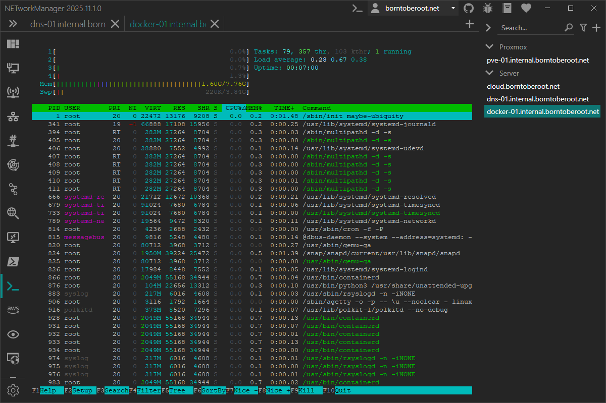

# PuTTY

With **PuTTY** you can connect to a remote computer via Secure Shell (SSH) or Telnet. In addition you can connect to a local serial port. The integration of PuTTY with NETworkManger supports tabs and profiles for hosts. The connection can be established via a profile (double-click, Enter key or right-click `Connect`) or directly via the [connection](#connect) dialog.

:::info

PuTTY is a free and open-source application that acts as a terminal emulator, serial console and network file transfer tool. It offers support for various network protocols such as SSH, Telnet, SCP, rlogin and raw socket connections. In addition to its networking capabilities, PuTTY allows connection to serial ports and provides convenient session management options for saving connection settings and quickly accessing frequently used systems. Its lightweight design and customizable interface make it a popular tool for system administrators and network engineers for tasks such as remote system administration, configuration and troubleshooting.

:::

:::note

PuTTY must be installed on the local computer in order to use this feature. You can download the latest version of PuTTY from the [official website](https://www.chiark.greenend.org.uk/~sgtatham/putty/latest.html).

:::

:::note

Right-click on the tab will open the context menu with the following options:

- **Reconnect** - Restart PuTTY and reconnect to the remote computer.
- **Resize** - Resize the PuTTY window to the current view size (if connected).
- **Restart session** - Restart the PuTTY session (if connected).

:::

## Connect

### Mode

Mode used to connect to the remote computer.

**Type:** `NETworkManager.Models.PuTTY.ConnectionMode`

**Default:** `SSH`

**Possible values:**

- `SSH`
- `Telnet`
- `Serial`
- `Rlogin`
- `RAW`

### Host

Hostname or IP address of the remote computer to connect to.

**Type:** `String`

**Default:** `Empty`

**Example:**

- `server-01.borntoberoot.net`
- `10.0.0.1`

:::note

Only available if [Mode](#mode) is set to `SSH`, `Telnet`, `Rlogin` or `RAW`.

:::

### Port

Port of the remote computer to connect to.

**Type:** `Integer` [Min `1`, Max `65535`]

**Default:**

- [`Settings > SSH port`](#ssh-port) if [Mode](#mode) is set to `SSH`
- [`Settings > Telnet port`](#telnet-port) if [Mode](#mode) is set to `Telnet`
- [`Settings > Rlogin port`](#rlogin-port) if [Mode](#mode) is set to `Rlogin`
- [`Settings > RAW port`](#raw-port) if [Mode](#mode) is set to `RAW`

:::note

Only available if [Mode](#mode) is set to `SSH`, `Telnet`, `Rlogin` or `RAW`.

:::

### Serial line

Serial line to connect to.

**Type:** `String`

**Default:** `COM1`

:::note

Only available if [Mode](#mode) is set to `Serial`.

:::

### Baud rate

Baud rate to use for the serial connection.

**Type:** `Integer`

**Default:** `9600`

**Possible values:**

- `300`
- `600`
- `1200`
- `2400`
- `4800`
- `9600`
- `14400`
- `19200`
- `28800`
- `38400`
- `57600`
- `115200`
- `128000`
- `256000`
- `512000`
- `921600`

:::note

Only available if [Mode](#mode) is set to `Serial`.

:::

### Username

Username to use for the connection.

**Type:** `String`

**Default:** [`Settings > Username`](#username-3)

**Example:** `root`

:::note

Only available if [Mode](#mode) is set to `SSH`, `Telnet` or `Rlogin`.

:::

### Private key file

Path to the private key file to use for the `SSH` connection.

**Type:** `String`

**Default:** [`Settings > Private key file`](#private-key-file-3)

**Example:** `C:\Users\BornToBeRoot\Documents\id_rsa.ppk`

:::note

Only available if [Mode](#mode) is set to `SSH`.

:::

### Profile

PuTTY profile to use for the connection.

**Type:** `String`

**Default:** [`Settings > Profile`](#profile-4)

**Example:** `NETworkManager`

:::note

Existing PuTTY profile to use for the connection. If no profile is specified, the default profile is used. Profiles are stored in the Windows registry under `HKEY_CURRENT_USER\Software\SimonTatham\PuTTY\Sessions`.

:::

### Additional command line

Additional command line parameters to use for the connection which are appended.

**Type:** `String`

**Default:** [`Settings > Additional command line`](#additional-command-line-3)

**Example:** `-pw test`

:::note

Additional command line parameters to use for the connection. For more information about the available parameters, see the [PuTTY documentation](https://the.earth.li/~sgtatham/putty/latest/htmldoc/Chapter3.html).

:::

## Profile

### Mode

Mode used to connect to the remote computer.

**Type:** `NETworkManager.Models.PuTTY.ConnectionMode`

**Default:** `SSH`

**Possible values:**

- `SSH`
- `Telnet`
- `Serial`
- `Rlogin`
- `RAW`

### Inherit host from general

Inherit the host from the general settings.

**Type:** `Boolean`

**Default:** `Enabled`

:::note

If this option is enabled, the [Host](#host-1) is overwritten by the host from the general settings and the [Host](#host-1) is disabled.

:::

### Host

Hostname or IP address of the remote computer to connect to.

**Type:** `String`

**Default:** `Empty`

**Example:**

- `server-01.borntoberoot.net`
- `10.0.0.1`

:::note

Only available if [Mode](#mode-1) is set to `SSH`, `Telnet`, `Rlogin` or `RAW`.

:::

### Serial line

Serial line to connect to.

**Type:** `String`

**Default:** `COM1`

:::note

Only available if [Mode](#mode-1) is set to `Serial`.

:::

### Port

Port of the remote computer to connect to.

**Type:** `Integer` [Min `1`, Max `65535`]

**Default:**

- [`Settings > SSH port`](#ssh-port) if [Mode](#mode-1) is set to `SSH`
- [`Settings > Telnet port`](#telnet-port) if [Mode](#mode-1) is set to `Telnet`
- [`Settings > Rlogin port`](#rlogin-port) if [Mode](#mode-1) is set to `Rlogin`
- [`Settings > RAW port`](#raw-port) if [Mode](#mode-1) is set to `RAW`

:::note

Only available if [Mode](#mode-1) is set to `SSH`, `Telnet`, `Rlogin` or `RAW`.

:::

### Baud rate

Baud rate to use for the serial connection.

**Type:** `Integer`

**Default:** `9600`

**Possible values:**

- `300`
- `600`
- `1200`
- `2400`
- `4800`
- `9600`
- `14400`
- `19200`
- `28800`
- `38400`
- `57600`
- `115200`
- `128000`
- `256000`
- `512000`
- `921600`

:::note

Only available if [Mode](#mode-1) is set to `Serial`.

:::

### Username

Username to use for the connection.

**Type:** `String`

**Default:** `Empty`

**Example:** `root`

:::note

Only available if [Mode](#mode-1) is set to `SSH`, `Telnet` or `Rlogin`.

:::

### Private key file

Path to the private key file to use for the `SSH` connection.

**Type:** `String`

**Default:** `Empty`

**Example:** `C:\Users\BornToBeRoot\Documents\id_rsa.ppk`

:::note

Only available if [Mode](#mode-1) is set to `SSH`.

:::

### Profile

PuTTY profile to use for the connection.

**Type:** `String`

**Default:** `Empty`

**Example:** `NETworkManager`

:::note

Existing PuTTY profile to use for the connection. If no profile is specified, the default profile is used. Profiles are stored in the Windows registry under `HKEY_CURRENT_USER\Software\SimonTatham\PuTTY\Sessions`.

:::

### Hostkey

SSH hostkey to use for the connection.

**Type:** `String`

**Default:** `Empty`

**Example:** `71:b8:f2:6e...`

:::note

This option overrides PuTTY's normal SSH host key caching policy by telling it exactly what host key to expect. The argument to this option should be either a host key fingerprint, or an SSH-2 public key blob. See the [PuTTY documentation](https://the.earth.li/~sgtatham/putty/0.78/htmldoc/Chapter3.html#using-general-opts) for more information.

:::

:::note

Only available if [Mode](#mode-1) is set to `SSH`.

:::

### Enable log

Enable logging of the connection to a file.

**Type:** `Boolean`

**Default:** `Disabled`

### Log mode

Mode used to log the connection.

**Type:** `NETworkManager.Models.PuTTY.LogMode`

**Default:** `Session log`

**Possible values:**

- `Session log`
- `SSH log`
- `SSH and Raw log`

:::note

See the [PuTTY documentation](https://the.earth.li/~sgtatham/putty/0.78/htmldoc/Chapter4.html#config-logging) for more information.

:::

:::note

Only available if [Enable log](#enable-log) is enabled.

:::

### Log path

Folder to store the log file in.

**Type:** `String`

**Default:** `%LocalAppData%\NETworkManager\PuTTY_Log`

**Example:** `C:\Users\BornToBeRoot\AppData\Local\NETworkManager\PuTTY_Log`

:::note

Only available if [Enable log](#enable-log) is enabled.

:::

### Log file name

Name of the log file.

**Type:** `String`

**Default:** `&H_&Y-&M-&D_&T.log`

**Example:** `server-01_2020-01-01_12-00-00.log`

:::note

Only available if [Enable log](#enable-log) is enabled.

:::

### Additional command line

Additional command line parameters to use for the connection which are appended.

**Type:** `String`

**Default:** `Empty`

**Example:** `-pw test`

:::note

Additional command line parameters to use for the connection. For more information about the available parameters, see the [PuTTY documentation](https://the.earth.li/~sgtatham/putty/latest/htmldoc/Chapter3.html).

:::

## Group

### Username

Username to use for the connection.

**Type:** `String`

**Default:** `Empty`

**Example:** `root`

:::note

Only available if [Mode](#mode-1) is set to `SSH`, `Telnet` or `Rlogin`.

:::

### Private key file

Path to the private key file to use for the `SSH` connection.

**Type:** `String`

**Default:** `Empty`

**Example:** `C:\Users\BornToBeRoot\Documents\id_rsa.ppk`

:::note

Only available if [Mode](#mode-1) is set to `SSH`.

:::

### Profile

PuTTY profile to use for the connection.

**Type:** `String`

**Default:** `Empty`

**Example:** `NETworkManager`

:::note

Existing PuTTY profile to use for the connection. If no profile is specified, the default profile is used. Profiles are stored in the Windows registry under `HKEY_CURRENT_USER\Software\SimonTatham\PuTTY\Sessions`.

:::

### Enable log

Enable logging of the connection to a file.

**Type:** `Boolean`

**Default:** `Disabled`

### Log mode

Mode used to log the connection.

**Type:** `NETworkManager.Models.PuTTY.LogMode`

**Default:** `Session log`

**Possible values:**

- `Session log`
- `SSH log`
- `SSH and Raw log`

:::note

See the [PuTTY documentation](https://the.earth.li/~sgtatham/putty/0.78/htmldoc/Chapter4.html#config-logging) for more information.

:::

:::note

Only available if [Enable log](#enable-log-1) is enabled.

:::

### Log path

Folder to store the log file in.

**Type:** `String`

**Default:** `%LocalAppData%\NETworkManager\PuTTY_Log`

**Example:** `C:\Users\BornToBeRoot\AppData\Local\NETworkManager\PuTTY_Log`

:::note

Only available if [Enable log](#enable-log-1) is enabled.

:::

### Log file name

Name of the log file.

**Type:** `String`

**Default:** `&H_&Y-&M-&D_&T.log`

**Example:** `server-01_2020-01-01_12-00-00.log`

:::note

Only available if [Enable log](#enable-log-1) is enabled.

:::

### Additional command line

Additional command line parameters to use for the connection which are appended.

**Type:** `String`

**Default:** `Empty`

**Example:** `-pw test`

:::note

Additional command line parameters to use for the connection. For more information about the available parameters, see the [PuTTY documentation](https://the.earth.li/~sgtatham/putty/latest/htmldoc/Chapter3.html).

:::

## Settings

### File path

Path to the PuTTY executable.

**Type:** `String`

**Default:** `%ProgramFiles%\PuTTY\putty.exe`, `%ProgramFiles(x86)%\PuTTY\putty.exe`

**Example:**

- `C:\Program Files\PuTTY\putty.exe`

:::note

The `Configure` button opens the PuTTY application to configure it.

:::

### Mode

Mode used to connect to the remote computer.

**Type:** `NETworkManager.Models.PuTTY.ConnectionMode`

**Default:** `SSH`

**Possible values:**

- `SSH`
- `Telnet`
- `Serial`
- `Rlogin`
- `RAW`

### Username

Username to use for the connection.

**Type:** `String`

**Default:** `Empty`

**Example:** `root`

:::note

Only available if [Mode](#mode-2) is set to `SSH`, `Telnet` or `Rlogin`.

:::

### Private key file

Path to the private key file to use for the `SSH` connection.

**Type:** `String`

**Default:** `Empty`

**Example:** `C:\Users\BornToBeRoot\Documents\id_rsa.ppk`

:::note

Only available if [Mode](#mode-1) is set to `SSH`.

:::

### Profile

PuTTY profile to use for the connection.

**Type:** `String`

**Default:** `NETworkManager`

**Example:** `NETworkManager`

:::note

Existing PuTTY profile to use for the connection. If no profile is specified, the default profile is used. Profiles are stored in the Windows registry under `HKEY_CURRENT_USER\Software\SimonTatham\PuTTY\Sessions`.

:::

### Enable log

Enable logging of the connection to a file.

**Type:** `Boolean`

**Default:** `Disabled`

### Log mode

Mode used to log the connection.

**Type:** `NETworkManager.Models.PuTTY.LogMode`

**Default:** `Session log`

**Possible values:**

- `Session log`
- `SSH log`
- `SSH and Raw log`

:::note

See the [PuTTY documentation](https://the.earth.li/~sgtatham/putty/0.78/htmldoc/Chapter4.html#config-logging) for more information.

:::

:::note

Only available if [Enable log](#enable-log-2) is enabled.

:::

### Log path

Folder to store the log file in.

**Type:** `String`

**Default:** `%LocalAppData%\NETworkManager\PuTTY_Log`

**Example:** `C:\Users\BornToBeRoot\AppData\Local\NETworkManager\PuTTY_Log`

:::note

Only available if [Enable log](#enable-log-2) is enabled.

:::

### Log file name

Name of the log file.

**Type:** `String`

**Default:** `&H_&Y-&M-&D_&T.log`

**Example:** `server-01_2020-01-01_12-00-00.log`

:::note

Only available if [Enable log](#enable-log-2) is enabled.

:::

### Additional command line

Additional command line parameters to use for the connection which are appended.

**Type:** `String`

**Default:** `Empty`

**Example:** `-pw test`

:::note

Additional command line parameters to use for the connection. For more information about the available parameters, see the [PuTTY documentation](https://the.earth.li/~sgtatham/putty/latest/htmldoc/Chapter3.html).

:::

### SSH port

Port to use for `SSH` connections.

**Type:** `Integer`

**Default:** `22`

**Example:** `22`

### Telnet port

Port to use for `Telnet` connections.

**Type:** `Integer`

**Default:** `23`

**Example:** `23`

### Serial line

Serial line to use for `Serial` connections.

**Type:** `String`

**Default:** `COM1`

**Example:** `COM5`

### Baud rate

Baud rate to use for `Serial` connections.

**Type:** `Integer`

**Default:** `9600`

**Example:** `115200`

### Rlogin port

Port to use for `Rlogin` connections.

**Type:** `Integer`

**Default:** `513`

**Example:** `513`

### RAW port

Port to use for `RAW` connections.

**Type:** `Integer`

**Default:** `23`

**Example:** `23`
