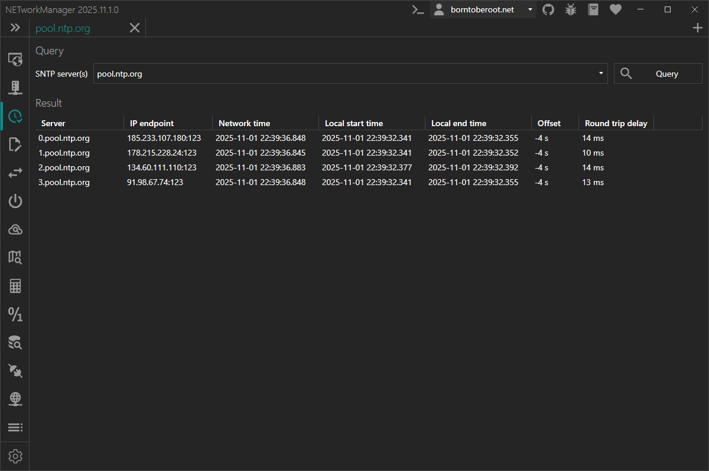

# SNTP Lookup

With **SNTP Lookup** you can query one or more SNTP servers to get the current network time and view the offset to the local clock.

:::info

SNTP (Simple Network Time Protocol) is a simplified version of NTP (Network Time Protocol) used for synchronizing clocks between devices on a network. It is designed for scenarios where precise timing is not critical. SNTP servers obtain their time from upstream NTP or SNTP servers and distribute it to clients. SNTP operates over UDP and uses port 123 by default. It is widely supported by operating systems and network devices.

:::

### Context menu

| Action | Description |
|--------|-------------|
| **Copy** | Copies the selected information to the clipboard |
| **Export...** | Exports the selected or all results to a file |

## Settings

### SNTP servers

List of SNTP server profiles. A profile can contain one or more SNTP servers with host/IP address and port.

**Type:** `List<NETworkManager.Models.Network.ServerConnectionInfoProfile>`

**Default:**

| Name              | Server(s)                                                                                                     |
| ----------------- | ------------------------------------------------------------------------------------------------------------- |
| Cloudflare        | `time.cloudflare.com:123`                                                                                     |
| Google Public NTP | `time.google.com:123; time1.google.com:123; time2.google.com:123; time3.google.com:123; time4.google.com:123` |
| Microsoft         | `time.windows.com:123`                                                                                        |
| pool.ntp.org      | `0.pool.ntp.org:123; 1.pool.ntp.org:123; 2.pool.ntp.org:123; 3.pool.ntp.org:123`                              |

:::note

Right-click on a selected SNTP server profile to `edit` or `delete` it.

You can also use the Hotkeys `F2` (`edit`) or `Del` (`delete`) on a selected SNTP server profile.

At least one SNTP server profile must exist.

:::

### Timeout (ms)

Timeout in milliseconds after the SNTP request is canceled.

**Type:** `Integer` [Min `100`, Max `15000`]

**Default:** `4000`
