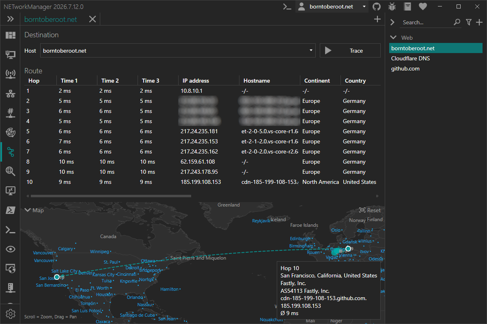

# Traceroute

With the **Traceroute** you can trace the route to a host using ICMP echo requests to determine the network path and each intermediate hop.

:::info

Traceroute works by sending ICMP packets with incrementally increasing TTL (Time to Live) values. Each router along the path decrements the TTL by one; when it reaches zero, the router discards the packet and sends back an ICMP "time exceeded" message, revealing its address. This process repeats until the destination is reached.

:::

### Example inputs

- `server-01.borntoberoot.net`
- `10.0.0.1`

### Context menu

| Action | Description |
|--------|-------------|
| **Copy** | Copies the selected information to the clipboard |
| **Export...** | Exports the selected or all results to a file |

## Profile

### Inherit host from general

Inherit the host from the general settings.

**Type:** `Boolean`

**Default:** `Enabled`

:::note

If this option is enabled, the [Host](#host) is overwritten by the host from the general settings and the [Host](#host) is disabled.

:::

### Host

Hostname or IP address to trace the route to.

**Type:** `String`

**Default:** `Empty`

**Example:**

- `server-01.borntoberoot.net`
- `1.1.1.1`

## Settings

### Maximum hops

Maximum number of hops to search for the target.

**Type:** `Integer` [Min `1`, Max `255`]

**Default:** `30`

### Timeout (ms)

Timeout in milliseconds for each ICMP packet, after which the packet is considered lost.

**Type:** `Integer` [Min `100`, Max `15000`]

**Default:** `4000`

### Buffer

Buffer size of the ICMP packet.

**Type:** `Integer` [Min `1`, Max `65535`]

**Default:** `32`

### Resolve hostname

Resolve the hostname of the IP address (PTR lookup) for each hop.

**Type:** `Boolean`

**Default:** `Enabled`

### Check IP geolocation

Enables or disables the resolution of the IP geolocation for each hop via [`ip-api.com`](https://ip-api.com/).

:::note

The free API endpoint is limited to 45 requests per minute, supports only the `http` protocol and is available for non-commercial use only.

:::

**Type:** `Boolean`

**Default:** `Enabled`
