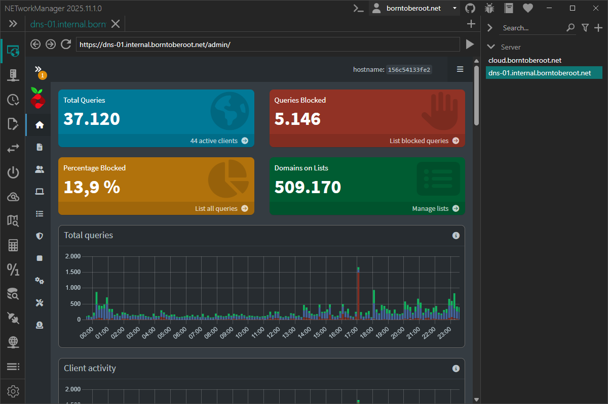

# Web Console

The **Web Console** is designed to browse the website of a host (e.g. server, switch, router, dashboard, etc.) to display informations or to configure it. The connection can be established via a profile (double-click, Enter key or right-click `Connect`) or directly via the [connection](#connect) dialog.

:::note

WebView2 must be installed on the local computer in order to use this feature. You can download the latest version of WebView2 from the [official website](https://developer.microsoft.com/de-de/microsoft-edge/webview2/).

:::

:::note

Right-click on the tab will open the context menu with the following options:

- **Reload** - Reload the website.

:::

## Connect

URL of the website to display in the web console.

**Type:** `String`

**Example:** `https://pihole.borntoberoot.net/admin/`

## Profile

### URL

URL of the website to display in the web console.

**Type:** `String`

**Default:** `Empty`

**Example:** `https://pihole.borntoberoot.net/admin/`

## Settings

### Show address bar

Show or hide the navigation / address bar.

**Type:** `Boolean`

**Default:** `Enabled`

### Show status bar

Show or hide the status bar in the bottom-left corner (e.g. to show the URL on hover).

**Type:** `Boolean`

**Default:** `Enabled`

### Save credentials

Enable or disable the option to save credentials in the WebView2 browser. This will display 
a dialog similar to the one in Microsoft Edge when a website requests to save the login informations.

**Type:** `Boolean`

**Default:** `Enabled`

### Delete browsing data

Button to delete the browsing data (e.g. history, cookies, cache, credentials, etc.) of the current WebView2 profile.
