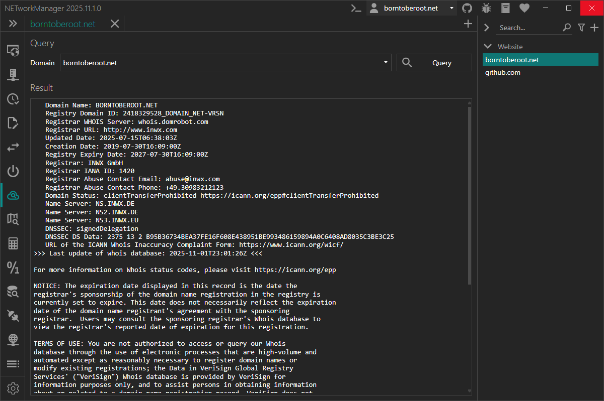

# Whois

With **Whois** you can retrieve Whois information for a domain directly from the Whois server associated with the top-level domain.

:::info

Whois data for a domain is publicly available and provided by the domain registrar. The Whois protocol is based on TCP and uses port 43. Data is transmitted as unencrypted plain text. Because the Whois protocol is not standardized, the format of the response may vary by registrar.

:::

:::note

The firewall must allow outgoing TCP connections on port 43 to the Whois server associated with the top-level domain. For example, querying `borntoberoot.net` requires access to `whois.verisign-grs.com:43`.

:::

:::warning

For .de domains, DENIC no longer provides information via the Whois protocol.

:::

### Example inputs

| Domain | Description |
|--------|-------------|
| `borntoberoot.net` | Query Whois information for a .net domain |

### Context menu

| Action | Description |
|--------|-------------|
| **Copy** | Copies the selected information to the clipboard |
| **Export...** | Exports the selected or all results to a file |

## Profile

### Inherit host from general

Inherit the host from the general settings.

**Type:** `Boolean`

**Default:** `Enabled`

:::note

If this option is enabled, the [domain](#domain) is overwritten by the host from the general settings and the [domain](#domain) is disabled.

:::

### Domain

Domain to query for Whois information.

**Type:** `String`

**Default:** `Empty`

**Example:** `borntoberoot.net`
