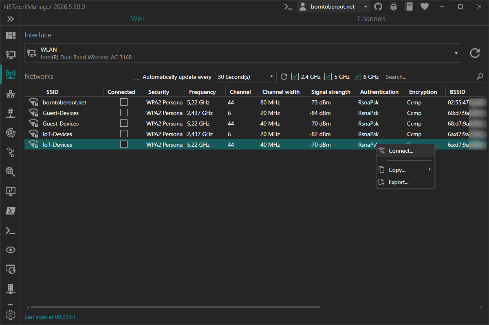
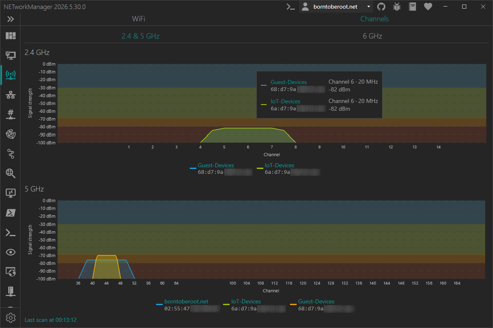

# WiFi

The **WiFi** tool shows all available wireless networks with details such as channel, signal strength, and encryption type.

Hidden wireless networks are shown as `Hidden Network`.

## WiFi

On the **WiFi** tab, you can select which wireless network adapter is used to scan for wireless networks. Wireless networks can be filtered by 2.4 GHz, 5 GHz, and 6 GHz.

In the search field, you can filter the wireless networks by `SSID`, `Security`, `Frequency`, `Channel`, `BSSID (MAC Address)`, `Vendor`, and `Phy kind`. The search is case-insensitive.

:::note

Starting with Windows 11 24H2, you need to allow access to the Wi-Fi adapter.

Open `Windows Settings > Privacy & security > Location`, enable access for Desktop Apps / NETworkManager, then restart the application.

:::

### Context menu

| Action         | Description                                                                        |
| -------------- | ---------------------------------------------------------------------------------- |
| **Connect...** | Opens a dialog to connect to the selected wireless network (only if not connected) |
| **Disconnect** | Disconnects from the selected wireless network (only if connected)                 |
| **Export...**  | Opens a dialog to export the selected or all wireless networks to a file           |
| **Copy**       | Copies the selected information to the clipboard                                   |

### Keyboard shortcuts

| Key  | Action            |
| ---- | ----------------- |
| `F5` | Scan for networks |

## Channels

On the **Channels** tab, all wireless networks of the selected wireless network adapter are displayed in a graphical view with channel, channel width, and signal strength. This can be useful to identify overlapping wireless networks that do not originate from the same access point.

The tab is split into two sub-tabs:

- **2.4 & 5 GHz** — shows networks on the 2.4 GHz and 5 GHz bands in a single chart each.
- **6 GHz** — shows 6 GHz networks in two separate charts: lower channels (1–125) and upper channels (129–233).

Each network is drawn as a proportional band reflecting its channel width (20, 40, 80, or 160 MHz), so overlapping networks can be identified more accurately.

:::note

Move the mouse over a network band to display details such as SSID, channel, channel width, and signal strength in a tooltip.

:::
