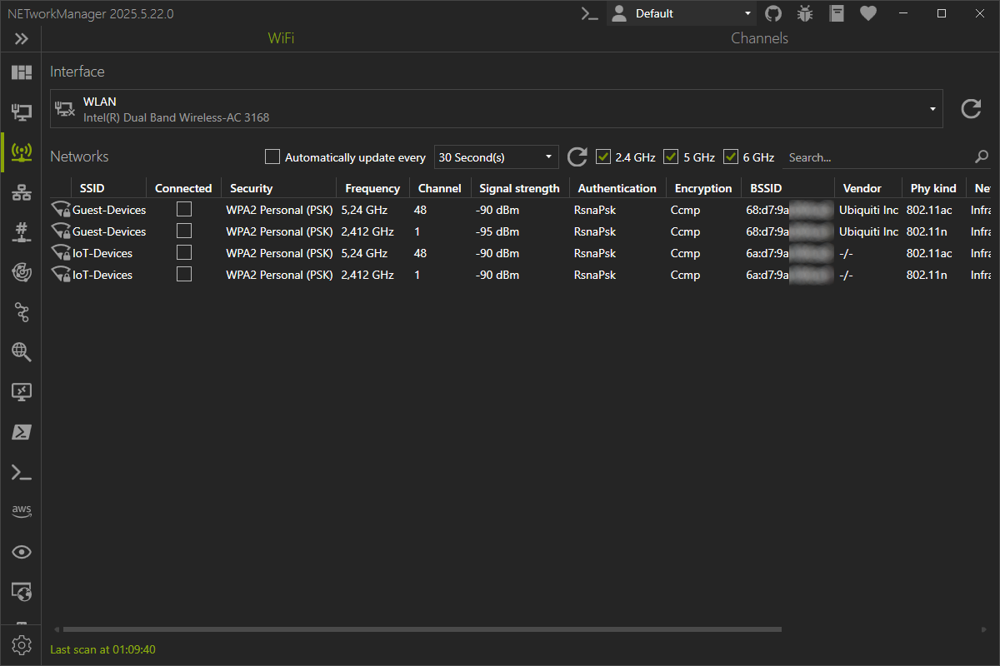
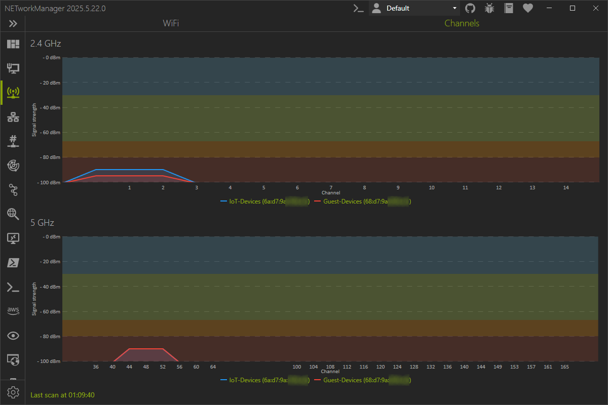

# WiFi

In **WiFi**, all available wireless networks are shown with additional details such as channel, signal strength or the type of encryption used.

Hidden wireless networks are displayed as `Hidden Network`.

## WiFi

On the **WiFi** tab, you can select which wireless network adapter is used to scan for wireless networks. Wireless networks can be filtered by 2.4 Ghz, 5 Ghz and the SSID.

Right-click on a wireless network opens a context menu with the following options:

- **Connect...**: Opens a dialog to connect to the selected wireless network.
- **Disconnect**: Disconnect from the selected wireless network.
- **Export...**: Opens a dialog to export the selected or all wireless network(s) to a file.

In the search field, you can filter the wireless networks by `SSID`, `Security`, `Channel`, `MAC Address (BSSID)`, `Vendor` and `Phy kind`. The search is case insensitive.

:::note

Due to limitations of the `Windows.Devices.WiFi` API the channel bandwidth cannot be detected.

:::

:::note

Right-click on the result to copy or export the information.

:::note

## Channels

On the **Channels** tab, all wireless networks of the selected wireless network adapter are displayed in a graphical view with the channel and signal strength. This can be useful to identify overlapping wireless networks that do not originate from the same access point.

:::note

You can move the mouse over the channel to display all wireless networks in a ToolTip that occupy that channel.

:::note

