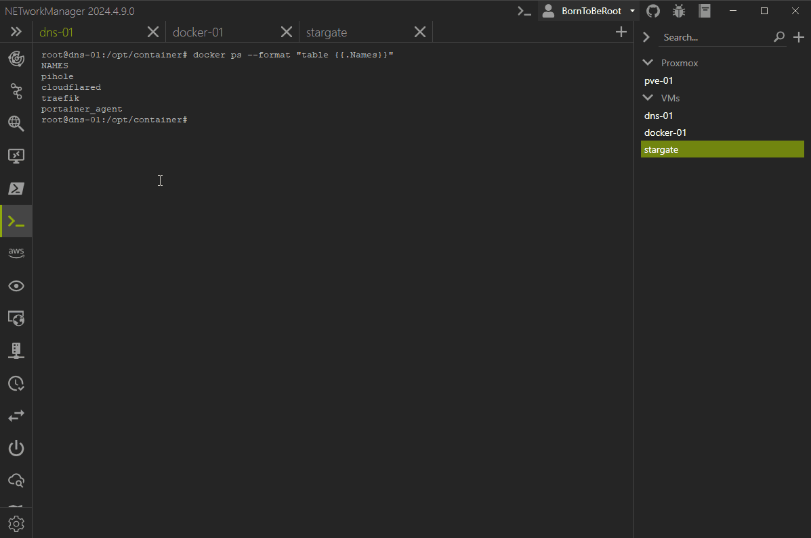

# 2024.4.21.0

Version: **2024.4.21.0**  
Release date: **21.04.2024**

| File                                                                                                                                                              | `SHA256`                                                           |
| ----------------------------------------------------------------------------------------------------------------------------------------------------------------- | ------------------------------------------------------------------ |
| [`NETworkManager_2024.4.21.0_Setup.exe`](https://github.com/BornToBeRoot/NETworkManager/releases/download/2024.4.21.0/NETworkManager_2024.4.21.0_Setup.exe)       | `C0A49E98C788CC0C69B0AAA87D7550B7307B797A761B8913D1CDAE305FDFF666` |
| [`NETworkManager_2024.4.21.0_Portable.zip`](https://github.com/BornToBeRoot/NETworkManager/releases/download/2024.4.21.0/NETworkManager_2024.4.21.0_Portable.zip) | `85AB794D44FEC49A08FBD261C00689E8D50A50DF9787B85946752B1F180373B6` |
| [`NETworkManager_2024.4.21.0_Archive.zip`](https://github.com/BornToBeRoot/NETworkManager/releases/download/2024.4.21.0/NETworkManager_2024.4.21.0_Archive.zip)   | `96DAFC53A89A86E7FF9C971F5136FD9474BF2CCB956C724EE93C10B231B25819` |

**System requirements**

- Windows 10 / Server x64 (1809 or later)
- [.NET Desktop Runtime 8.0 (LTS) - x64](https://dotnet.microsoft.com/en-us/download/dotnet/8.0/runtime)

## Breaking Changes

- **Network Interfaces**

  - Adding an additional IPv4 address to the network adapter will enable the `netsh` option `dhcpstaticipcoexistence` if the network adapter is configured to use DHCP. See [this](../application/network-interface.md#configure) for more information. [#2656](https://github.com/BornToBeRoot/NETworkManager/pull/2656)

## What's new?

- Tabs can now be arranged within the window using drag & drop. [#2669](https://github.com/BornToBeRoot/NETworkManager/pull/2669)

  

## Improvements

- **Network Interfaces**

  - Export to CSV, XML and JSON added. [#2626](https://github.com/BornToBeRoot/NETworkManager/pull/2626)

- **Ping Monitor**

  - Grouping of hosts added. Hosts are now grouped based on the profile or added to the default group. [#2645](https://github.com/BornToBeRoot/NETworkManager/pull/2645)

- **Discovery Protocol**

  - Export to CSV, XML and JSON added. [#2626](https://github.com/BornToBeRoot/NETworkManager/pull/2626)

- **IP Geolocation**

  - Export to CSV, XML and JSON added. [#2626](https://github.com/BornToBeRoot/NETworkManager/pull/2626)

- **Bit Calculator**

  - Export to CSV, XML and JSON added. [#2626](https://github.com/BornToBeRoot/NETworkManager/pull/2626)

## Bugfixes

- **General**

  - Fix some design issues for the `Run command` button. The button is now in the right-hand title bar instead of in the center until a better solution is found. [#2651](https://github.com/BornToBeRoot/NETworkManager/pull/2651)

- **IP Scanner**

  - `Add profile...` in dragged out tab fixed. [#2661](https://github.com/BornToBeRoot/NETworkManager/pull/2661)
  - `Export...` in dragged out tab fixed. [#2661](https://github.com/BornToBeRoot/NETworkManager/pull/2661)
  - Copy MAC address to clipboard fixed. [#2644](https://github.com/BornToBeRoot/NETworkManager/pull/2644)

- **Port Scanner**

  - `Open port profiles...` in dragged out tab fixed. [#2661](https://github.com/BornToBeRoot/NETworkManager/pull/2661)
  - `Export...` in dragged out tab fixed. [#2661](https://github.com/BornToBeRoot/NETworkManager/pull/2661)

- **Traceroute**

  - `Export...` in dragged out tab fixed. [#2661](https://github.com/BornToBeRoot/NETworkManager/pull/2661)

- **DNS Lookup**

  - `Export...` in dragged out tab fixed. [#2661](https://github.com/BornToBeRoot/NETworkManager/pull/2661)

- **SNMP**

  - `Open OID profiles...` in dragged out tab fixed. [#2661](https://github.com/BornToBeRoot/NETworkManager/pull/2661)
  - `Export...` in dragged out tab fixed. [#2661](https://github.com/BornToBeRoot/NETworkManager/pull/2661)

- **SNTP Lookup**

  - `Export...` in dragged out tab fixed. [#2661](https://github.com/BornToBeRoot/NETworkManager/pull/2661)

- **Whois**

  `Export...` in dragged out tab fixed. [#2661](https://github.com/BornToBeRoot/NETworkManager/pull/2661)

- **IP Geolocation**

  - `Export...` in dragged out tab fixed. [#2661](https://github.com/BornToBeRoot/NETworkManager/pull/2661)

## Dependencies, Refactoring & Documentation

- Code cleanup & refactoring
- Language files updated via [#transifex](https://github.com/BornToBeRoot/NETworkManager/pulls?q=author%3Aapp%2Ftransifex-integration)
- Dependencies updated via [#dependabot](https://github.com/BornToBeRoot/NETworkManager/pulls?q=author%3Aapp%2Fdependabot)
