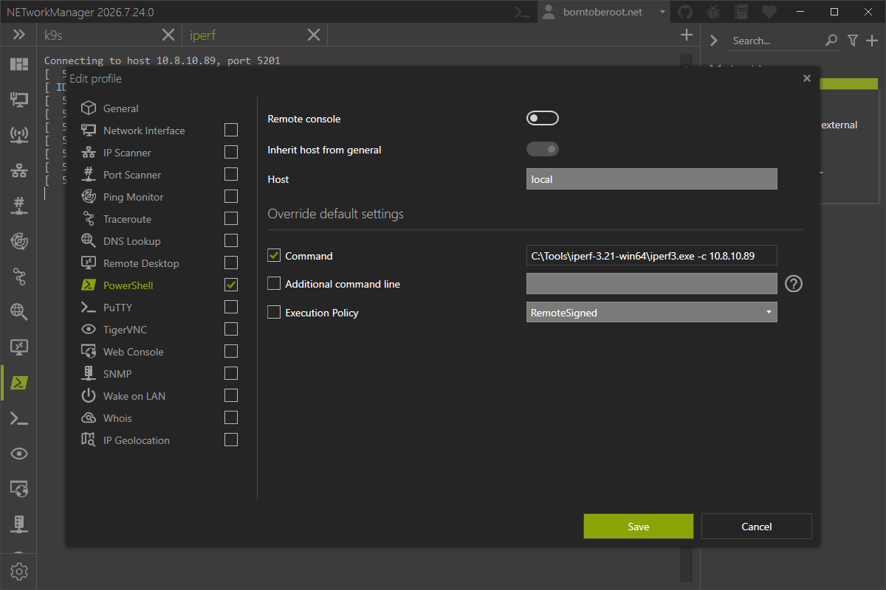
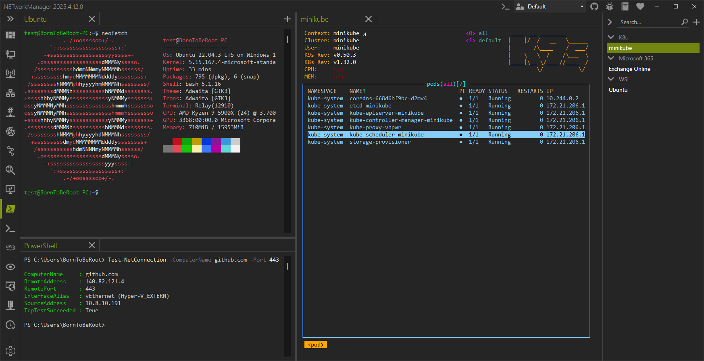

# PowerShell with command-line applications

### How do I run a command-line application in PowerShell?

You can extend the [PowerShell](../application/powershell) integration of NETworkManager to run almost any command-line application — or PowerShell module — with your own configuration. Save the configuration as a profile (or apply it globally or to a group) to make it reusable across sessions.



Create a new connection or profile with the following settings:

- Remote console: `False`
- Command: `<FilePath> <Arguments>`

```powershell
<FilePath> <Arguments>
```

:::tip

This works with any application or module that can be launched from a PowerShell console — not just the examples below.

:::

### Which command-line applications can I use?

The following examples show common command-line applications that can be used with a NETworkManager PowerShell profile.


#### K9s

A terminal UI to interact with and manage Kubernetes clusters.

- Remote console: `False`
- Command: `k9s`

```powershell
# Use the default kubeconfig context
k9s

# Use a specific kubeconfig context with read-only mode
k9s --context <CONTEXT> --readonly

# Use a specific kubeconfig file
k9s --kubeconfig <PATH_TO_KUBECONFIG>
```

:::note

[K9s](https://k9scli.io/) must be installed and configured (e.g. `kubeconfig`) on your system.

Create a separate profile for each Kubernetes cluster by passing a specific context or `kubeconfig` file.

:::



#### WSL (Windows Subsystem for Linux)

Run a Linux distribution directly inside a PowerShell tab.

- Remote console: `False`
- Command: `wsl -d <DISTRIBUTION>`

```powershell
wsl -d <DISTRIBUTION>
```

:::note

Windows Subsystem for Linux (WSL) must be installed and enabled on your system.

:::

#### iPerf

Measure network throughput between two endpoints.

- Remote console: `False`
- Command: `iperf3 -c <SERVER>`

```powershell
# Run as client
iperf3 -c <SERVER>

# Run as server
iperf3 -s
```

:::note

[iPerf3](https://iperf.fr/) must be installed on your system.

:::

#### Exchange Online

Connect to Exchange Online to manage mailboxes and tenant settings.

- Remote console: `False`
- Command: `Connect-ExchangeOnline -UserPrincipalName <USER_PRINCIPAL_NAME>`

```powershell
Connect-ExchangeOnline -UserPrincipalName <USER_PRINCIPAL_NAME>
```

:::note

The [ExchangeOnlineManagement](https://learn.microsoft.com/en-us/powershell/exchange/exchange-online-powershell-v2) PowerShell module must be installed on your system.

:::

#### AWS Session Manager

Connect to an EC2 instance without opening an inbound SSH port.

- Remote console: `False`
- Command: `aws ssm start-session --target <INSTANCE_ID>`

```powershell
aws ssm start-session --target <INSTANCE_ID>
```

:::note

AWS CLI and the AWS Session Manager Plugin must be installed and configured to connect to EC2 instances.

:::
