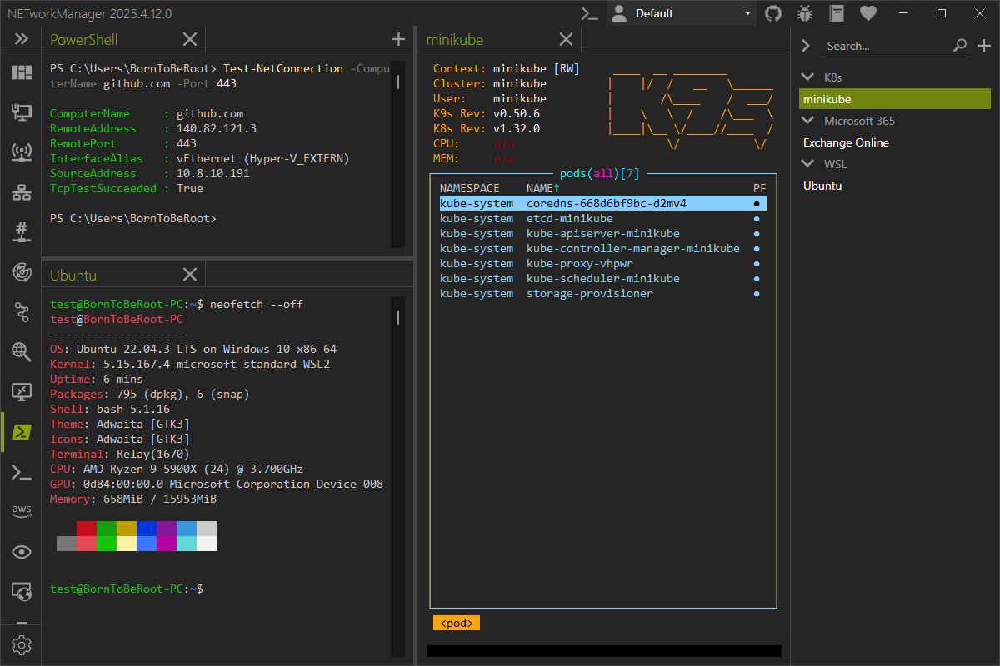

# PowerShell with command-line applications

Create a new connection or profile with the following settings:

- Remote console: `False`
- Command: `<FilePath> <Arguments>`

  ```PowerShell
  # Connect to WSL
  wsl -d <DISTRIBUTION>

  # Connect to an EC2 instance via AWS Session Manager
  aws ssm start-session --target <instance-id>

  # Connect to Kubernetes
  k9s --readonly
  ```

:::note

Windows Subsystem for Linux (WSL) must be installed and enabled on your system to use WSL.

AWS CLI and AWS Session Manager Plugin must be installed and configured to connect to EC2 instances.

:::



