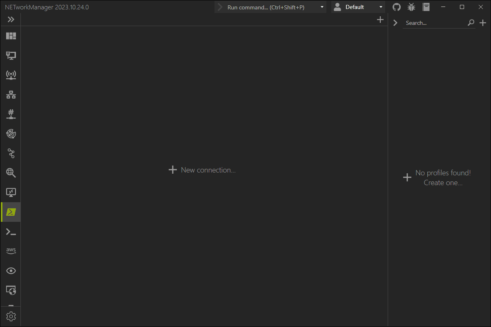

# PowerShell with WSL

## How to use Windows Subsystem for Linux (WSL) in PowerShell?

Create a new connection or profile with the following settings:

- Remote console: `False`
- Command: `wsl -d <DISTRIBUTION>`

:::note

Windows Subsystem for Linux (WSL) must be installed and enabled on your system to use this feature.

:::
