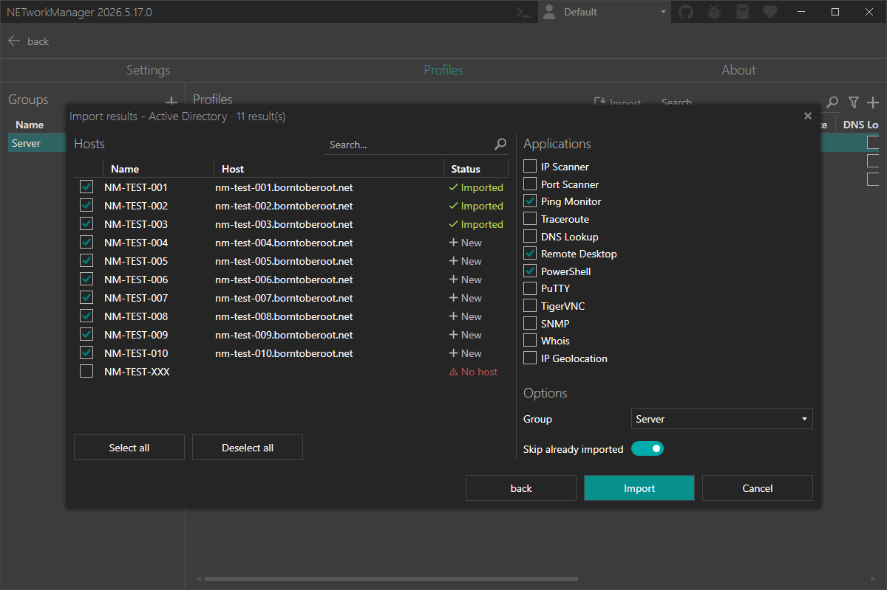

# Groups and Profiles

Groups and profiles can be used to organize your hosts and networks.

In groups you can define settings that are applied to all profiles in this group. Settings defined in a profile are applied to this profile only. See also [FAQ > Settings priority](/docs/faq/settings-priority) for more information about the settings priority.

## Overview

You can manage your groups and profiles in the `Settings` on the `Profiles` tab for all features.

:::note

Right-click on a selected group to `edit` or `delete` it.

Right-click on a selected profile to `edit`, `copy` or `delete` it.

You can also use the Hotkeys `F2` (`edit`) or `Del` (`delete`) on a selected group or profile.

:::

Inside a feature you can manage the groups and profiles enabled for this feature directly in the profiles view.

:::note

Right-click on a selected profile to `edit`, `copy` or `delete` it.

You can also use the Hotkeys `F2` (`edit`) or `Del` (`delete`) on a selected profile.

Right-click on a group header to `expand` or `collapse` all groups. The button to edit the group will be shown when hovering over the group header.

:::

## Group

In the group settings you can define general settings and feature specific settings.

## Profile

In the profile settings you can define general settings and feature specific settings.

:::note

Profiles are only displayed in the specific features if they have been enabled via the checkbox. The [`Profiles` tab in the `Settings`](#overview) will show all profiles.

Use `tags` to organize profiles and filter by them. For example, tag profiles as `prod` or `dns` to group related ones. You can filter by `any` or `all` tags.

:::

:::tip

Some settings like the `host` can be inherited from the general settings in the feature specific settings.

See also the profile section in the specific [feature documentation](./introduction) for more information.

:::

## Import

Profiles can be imported from an external source. To start the import, click **Import** on the [`Profiles` tab in `Settings`](#overview) and select an import source.

The following import sources are available:

- [Active Directory](#active-directory)

### Active Directory

Profiles can be imported from Active Directory by querying computer accounts via LDAP. After selecting **Active Directory** as the import source, configure the connection settings and click **Search**.

| Field                         | Description                                                                                                                                      |
| ----------------------------- | ------------------------------------------------------------------------------------------------------------------------------------------------ |
| **Search base**               | LDAP search base to query, e.g. `DC=domain,DC=com`.                                                                                              |
| **Server**                    | Hostname or IP address of the LDAP server. Leave empty to use the default domain controller.                                                     |
| **Port**                      | LDAP port. Defaults to `389` (LDAP) or `636` (LDAPS). Switches automatically when **Use SSL** is toggled.                                        |
| **Use SSL**                   | Connect using LDAPS (encrypted).                                                                                                                 |
| **Authentication**            | `Use current Windows credentials` authenticates as the logged-in user. `Use these credentials` allows specifying a custom username and password. |
| **Username**                  | Username for authentication. Only available when **Use these credentials** is selected.                                                          |
| **Password**                  | Password for authentication. Only available when **Use these credentials** is selected.                                                          |
| **Exclude disabled accounts** | Skip computer accounts that are disabled in Active Directory.                                                                                    |
| **Additional LDAP filter**    | Optional LDAP filter to narrow down results, e.g. `(operatingSystem=Windows Server*)`.                                                           |

Once the computers are found, proceed to [Review and import](#review-and-import) to select entries and configure import options.

### Review and import

Select the entries to import and configure the options before clicking **Import**.

**Hosts** (left panel)

| Column     | Description                                                                                                                                              |
| ---------- | -------------------------------------------------------------------------------------------------------------------------------------------------------- |
| **Name**   | Computer name from the import source.                                                                                                                    |
| **Host**   | Hostname used as the profile host address.                                                                                                               |
| **Status** | `New` — not yet imported. `Already imported` — already exists as a profile from this source. `No host` — cannot be imported (no host address available). |

**Applications** (right panel)

Select which applications to enable for the imported profiles. [Ping Monitor](./application/ping-monitor), [Remote Desktop](./application/remote-desktop), and [PowerShell](./application/powershell) are enabled by default.

**Options** (right panel)

| Field                     | Description                                                                                |
| ------------------------- | ------------------------------------------------------------------------------------------ |
| **Group**                 | Target group for the imported profiles. Select an existing group or type a new group name. |
| **Skip already imported** | Skip profiles that have already been imported from this source. Default is `Enabled`.      |

After clicking **Import**, a summary dialog shows how many profiles were imported, how many were skipped as duplicates, and how many were skipped because no host address was available.
