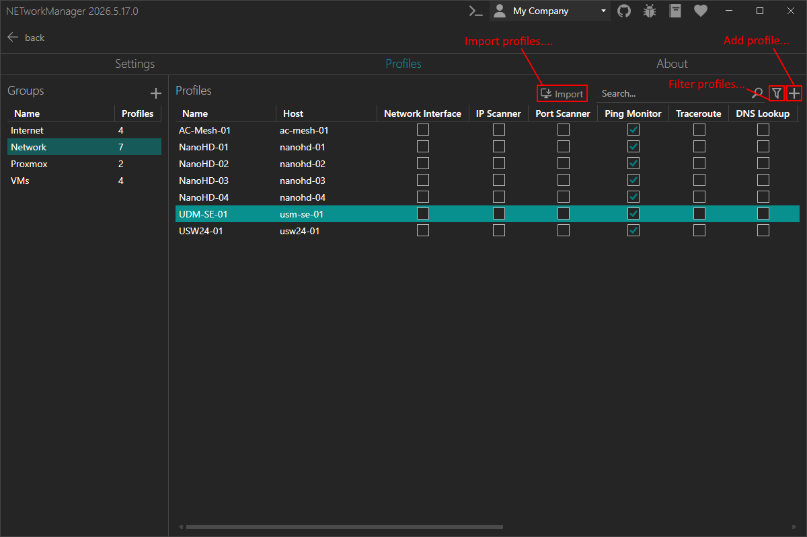
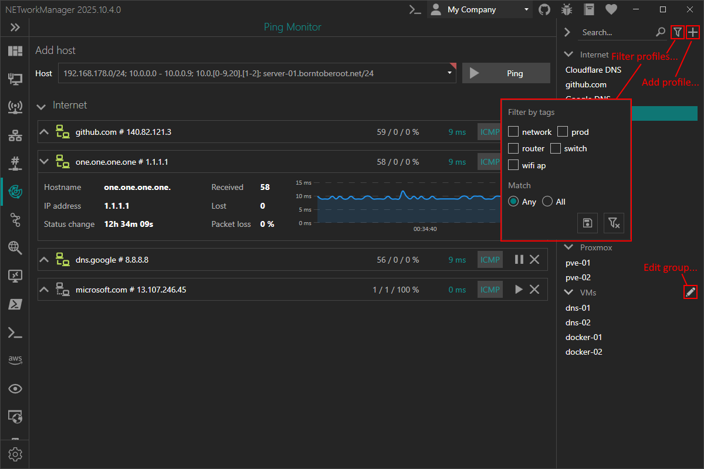
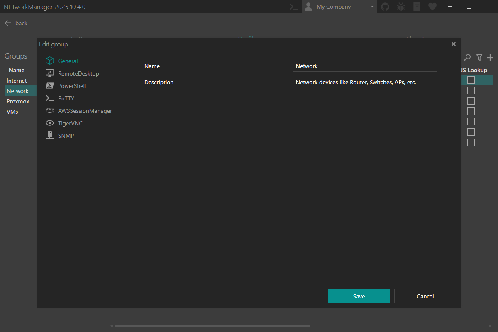
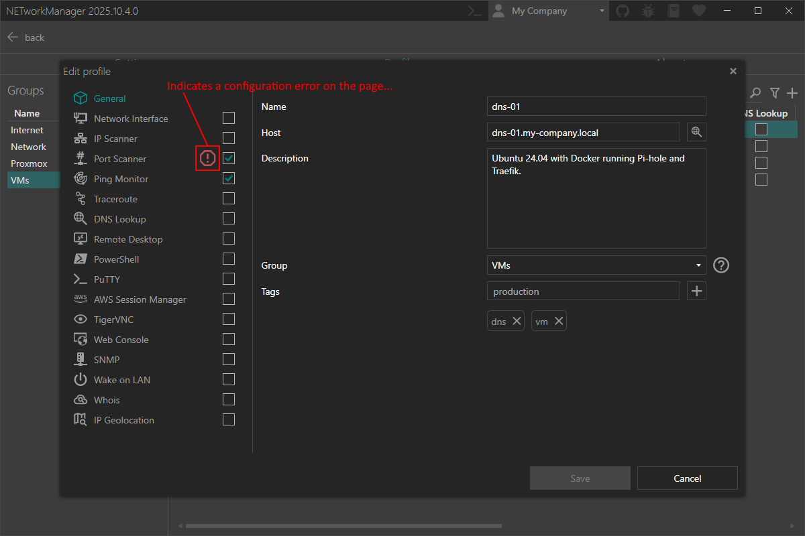

# Groups and Profiles

**Groups and Profiles** let you organize hosts and networks for quick access across all NETworkManager features. Settings defined in a group apply to every profile in that group; settings defined on a profile override the group defaults. See [FAQ > Settings priority](/docs/faq/settings-priority) for more information about the priority order.

## Overview

Groups and profiles for all features are managed on the `Profiles` tab in `Settings`.

### Context menu

Right-click a selected group to open the group context menu.

| Action     | Description                     |
| ---------- | ------------------------------- |
| **Edit**   | Open the group settings dialog. |
| **Delete** | Delete the selected group.      |

Right-click a selected profile to open the profile context menu.

| Action     | Description                            |
| ---------- | -------------------------------------- |
| **Edit**   | Open the profile settings dialog.      |
| **Copy**   | Create a copy of the selected profile. |
| **Delete** | Delete the selected profile.           |

### Keyboard shortcuts

| Key   | Action                                |
| ----- | ------------------------------------- |
| `F2`  | Edit the selected group or profile.   |
| `Del` | Delete the selected group or profile. |

Inside a feature, the profile view shows only the groups and profiles enabled for that feature.

:::note

The edit button for a group appears when hovering over the group header.

:::

### Context menu

Right-click a selected profile to open the profile context menu.

| Action     | Description                            |
| ---------- | -------------------------------------- |
| **Edit**   | Open the profile settings dialog.      |
| **Copy**   | Create a copy of the selected profile. |
| **Delete** | Delete the selected profile.           |

Right-click a group header to expand or collapse all groups.

| Action           | Description          |
| ---------------- | -------------------- |
| **Expand all**   | Expand all groups.   |
| **Collapse all** | Collapse all groups. |

### Keyboard shortcuts

| Key   | Action                       |
| ----- | ---------------------------- |
| `F2`  | Edit the selected profile.   |
| `Del` | Delete the selected profile. |

## Group

In the group settings you can define general settings and feature-specific settings.

## Profile

In the profile settings you can define general settings and feature-specific settings.

:::note

Profiles are only displayed in a specific feature if they have been enabled via the checkbox. The [`Profiles` tab in `Settings`](#overview) shows all profiles regardless.

Use **tags** to organize profiles and filter by them. For example, tag profiles as `prod` or `dns` to group related ones. You can filter by `any` or `all` tags.

:::

:::tip

Some settings, such as the `host`, can be inherited from the general settings in the feature-specific settings.

See also the profile section in the specific [feature documentation](./introduction) for more information.

:::

## Import

Profiles can be imported from an external source. To start the import, click **Import** on the [`Profiles` tab in `Settings`](#overview) and select an import source.

The following import sources are available:

- [Active Directory](#active-directory)

### Active Directory

Profiles can be imported from Active Directory by querying computer accounts via LDAP. After selecting **Active Directory** as the import source, configure the connection settings and click **Search**.

<!--  -->

| Field                         | Description                                                                                                                                      |
| ----------------------------- | ------------------------------------------------------------------------------------------------------------------------------------------------ |
| **Search base**               | LDAP search base to query, e.g. `DC=domain,DC=com`.                                                                                              |
| **Server**                    | Hostname or IP address of the LDAP server. Leave empty to use the default domain controller.                                                     |
| **Port**                      | LDAP port. Defaults to `389` (LDAP) or `636` (LDAPS). Switches automatically when **Use SSL** is toggled.                                        |
| **Use SSL**                   | Connect using LDAPS (encrypted).                                                                                                                 |
| **Authentication**            | `Use current Windows credentials` authenticates as the logged-in user. `Use these credentials` allows specifying a custom username and password. |
| **Username**                  | Username for authentication. Only available when **Use these credentials** is selected.                                                          |
| **Password**                  | Password for authentication. Only available when **Use these credentials** is selected.                                                          |
| **Exclude disabled accounts** | Skip computer accounts that are disabled in Active Directory.                                                                                    |
| **Additional LDAP filter**    | Optional LDAP filter to narrow down results, e.g. `(operatingSystem=Windows Server*)`.                                                           |

Once the computers are found, proceed to [Review and import](#review-and-import) to select entries and configure import options.

### Review and import

Select the entries to import and configure the options before clicking **Import**.

<!--  -->

**Hosts** (left panel)

| Column     | Description                                                                                                                                              |
| ---------- | -------------------------------------------------------------------------------------------------------------------------------------------------------- |
| **Name**   | Computer name from the import source.                                                                                                                    |
| **Host**   | Hostname used as the profile host address.                                                                                                               |
| **Status** | `New` — not yet imported. `Already imported` — already exists as a profile from this source. `No host` — cannot be imported (no host address available). |

**Applications** (right panel)

Select which applications to enable for the imported profiles. [Ping Monitor](./application/ping-monitor), [Remote Desktop](./application/remote-desktop), and [PowerShell](./application/powershell) are enabled by default.

**Options** (right panel)

| Field                     | Description                                                                                |
| ------------------------- | ------------------------------------------------------------------------------------------ |
| **Group**                 | Target group for the imported profiles. Select an existing group or type a new group name. |
| **Skip already imported** | Skip profiles that have already been imported from this source. Default is `Enabled`.      |

After clicking **Import**, a summary dialog shows how many profiles were imported, how many were skipped as duplicates, and how many were skipped because no host address was available.
