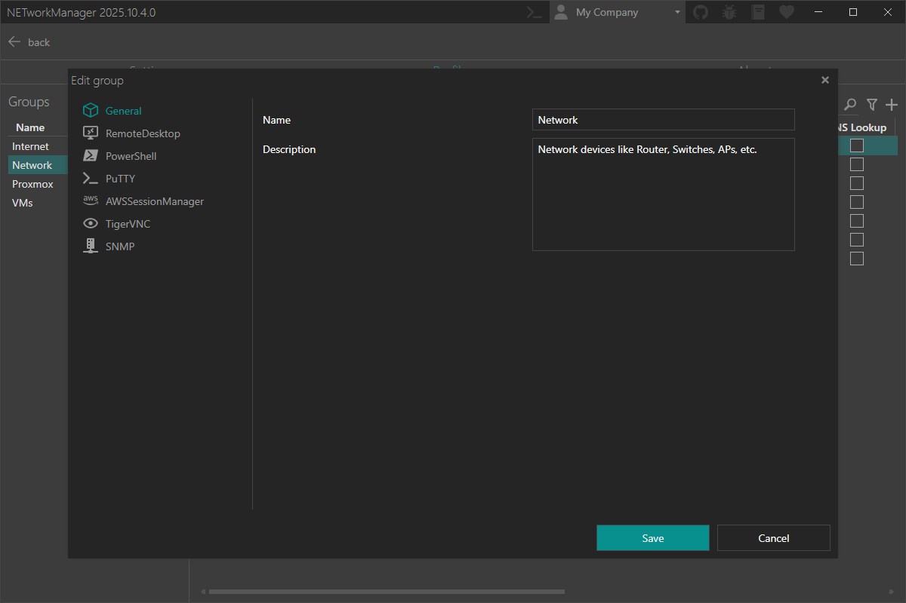

# Groups and Profiles

Groups and profiles can be used to organize your hosts and networks.

In groups you can define settings that are applied to all profiles in this group. Settings defined in a profile are applied to this profile only. See also [FAQ > Settings priority](/docs/faq/settings-priority) for more information about the settings priority.

## Overview

You can manage your groups and profiles in the `Settings` on the `Profiles` tab for all features.

:::note

Right-click on a selected group to `edit` or `delete` it.

Right-click on a selected profile to `edit`, `copy` or `delete` it.

You can also use the Hotkeys `F2` (`edit`) or `Del` (`delete`) on a selected group or profile.

:::

Inside a feature you can manage the groups and profiles enabled for this feature directly in the profiles view.

:::note

Right-click on a selected profile to `edit`, `copy` or `delete` it.

You can also use the Hotkeys `F2` (`edit`) or `Del` (`delete`) on a selected profile.

Right-click on a group header to `expand` or `collapse` all groups. The button to edit the group will be shown when hovering over the group header.

:::

## Group

In the group settings you can define general settings and feature specific settings.

## Profile

In the profile settings you can define general settings and feature specific settings.

:::note

Profiles are only displayed in the specific features if they have been enabled via the checkbox. The [`Profiles` tab in the `Settings`](#overview) will show all profiles.

Use `tags` to organize profiles and filter by them. For example, tag profiles as `prod` or `dns` to group related ones. You can filter by `any` or `all` tags.

:::

:::tip

Some settings like the `host` can be inherited from the general settings in the feature specific settings.

See also the profile section in the specific [feature documentation](./introduction) for more information.

:::

