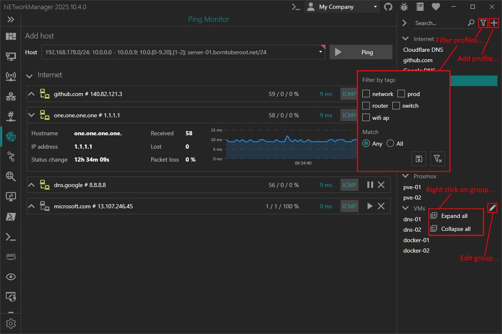

# Groups and Profiles

Groups and profiles can be used to organize your hosts and networks.

In groups you can define settings that are applied to all profiles in this group. Settings defined in a profile are applied to this profile only. See also [FAQ > Settings priority](/docs/faq/settings-priority) for more information about the settings priority.

## Overview

You can manage your groups and profiles in the "Settings" on the "Profile" tab for all features.

:::note

Right-click on a selected group to `edit` or `delete` it.

Right-click on a selected profile to `edit`, `copy` or `delete` it.

You can also use the Hotkeys `F2` (`edit`) or `Del` (`delete`) on a selected group or profile.

:::

Inside a feature you can manage the groups and profiles enabled for this feature directly in the profiles view.

:::note

Right-click on a selected profile to `edit`, `copy` or `delete` it.

You can also use the Hotkeys `F2` (`edit`) or `Del` (`delete`) on a selected profile.

:::

## Group

## Profile
