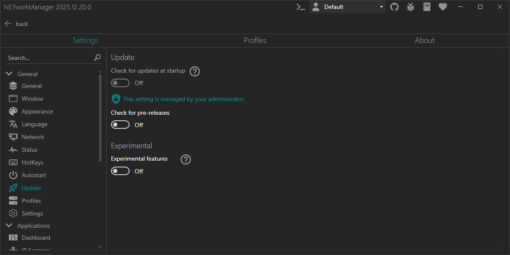

# System-Wide Policies

System-wide policies allow administrators to enforce specific settings for all users on a machine. These policies override user-specific settings and provide centralized control over application behavior in enterprise environments.

## Overview

Policies are defined in a `config.json` file placed in the application installation directory (the same folder as `NETworkManager.exe`). When this file exists, the application loads the policies at startup and applies them with precedence over user settings.

Users will see a visual indicator in the Settings UI when a setting is controlled by a system-wide policy, showing them the administrator-enforced value and preventing them from changing it.



## Configuration File

The `config.json` file uses a simple JSON structure to define policy values. An example file (`config.json.example`) is included in the application installation directory for reference.

**File Location:**
- **Installed version**: `C:\Program Files\NETworkManager\config.json` (or your custom installation path)
- **Portable version**: Same directory as `NETworkManager.exe`

**File Format:**

```json
{
  "Policy_Name1": true,
  "Policy_Name2": "ExampleValue"
}
```


**Example with available policies:**

```json
{
  "Update_CheckForUpdatesAtStartup": false,
  "SettingsFolderLocation": "C:\\ProgramData\\NETworkManager\\Settings"
}
```

For a complete list of available policies, see the [Available Policies](#available-policies) section below.

Property names generally follow the pattern `Section_SettingName` (see each setting's documentation). Ensure values use the correct JSON type (boolean, string, number, etc.).

:::note

- The file must be named exactly `config.json`
- The file must contain valid JSON syntax
- Changes to the file require restarting the application to take effect
- If the file doesn't exist or contains invalid JSON, it will be ignored and user settings will apply

:::

## Deployment

For enterprise deployments:

1. **Create the configuration file**: 
   - Use the `config.json.example` as a template
   - Rename it to `config.json`
   - Set your desired policy values (you find them in the corresponding setting's documentation)

2. **Deploy to installation directory**:
   - Place the `config.json` file in the same directory as `NETworkManager.exe`
   - For MSI installations, this is typically `C:\Program Files\NETworkManager\`
   - For portable installations, place it next to the executable

3. **Deploy methods**:
   - Group Policy — copy the `config.json` file to the installation directory (use Group Policy preferences or a startup script)
   - Configuration management tools — SCCM/ConfigMgr, Microsoft Intune, Ansible, etc.
   - Scripts and deployment toolkits — PowerShell scripts, PSAppDeployToolkit (recommended for scripted MSI/App deployments)
   - Manual deployment — hand-copy for small-scale rollouts

4. **Verification**:
   - Launch the application
   - Navigate to Settings > Update (e.g., "Check for updates at startup")
   - Verify the shield icon and the administrator message appear and that the control is disabled
   - Confirm the displayed value matches the policy

:::warning

Ensure the `config.json` file has appropriate permissions so that regular users cannot modify it. On standard installations in `Program Files`, this is automatically enforced by Windows file permissions.

:::

## Troubleshooting

**Policy not being applied:**
- Verify the file is named exactly `config.json` (not `config.json.txt`)
- Check that the JSON syntax is valid (use a JSON validator)
- Confirm the file is in the correct directory (same as `NETworkManager.exe`)
- Restart the application after creating or modifying the file
- Check the application logs for any error messages related to policy loading

**Policy values not showing in UI:**
- Ensure the property name matches exactly (see the corresponding setting's documentation for the property name)
- Verify the value is a boolean (`true` or `false`), not a string (`"true"` or `"false"`)
- Check that there are no syntax errors in the JSON file

## Available Policies

### Update_CheckForUpdatesAtStartup

Control whether the application checks for updates at startup.

**Type**: `Boolean` (true/false)

**Default**: User setting applies

**Example**:
```json
{
  "Update_CheckForUpdatesAtStartup": false
}
```

See [Check for updates at startup](./settings/update.md#check-for-updates-at-startup) for more details.

### SettingsFolderLocation

Override the default location where application settings are stored.

**Type**: `String` (absolute path)

**Default**: User Documents folder or portable location

**Example**:
```json
{
  "SettingsFolderLocation": "C:\\ProgramData\\NETworkManager\\Settings"
}
```

See [Location](./settings/settings.md#location) for more details.

:::warning

When configuring a custom settings folder location, ensure:
- The path **must be an absolute path** (e.g., `C:\\Path\\To\\Folder`, not `.\\RelativePath`)
- The path uses double backslashes (`\\`) in JSON format
- The path does not contain invalid characters for the file system
- The application has read/write permissions to the specified directory
- The directory exists or the application has permissions to create it
- All users have appropriate access to the folder if using a shared location

If the policy-provided path is invalid (not absolute or contains invalid characters), the application will log an error and fall back to the default location.

:::

## Future Policies

Additional policy options will be added in future releases to provide more granular control over application behavior. If you have specific requirements for system-wide policies in your organization, please submit a feature request via the [GitHub issue tracker](https://github.com/BornToBeRoot/NETworkManager/issues/new/choose).
