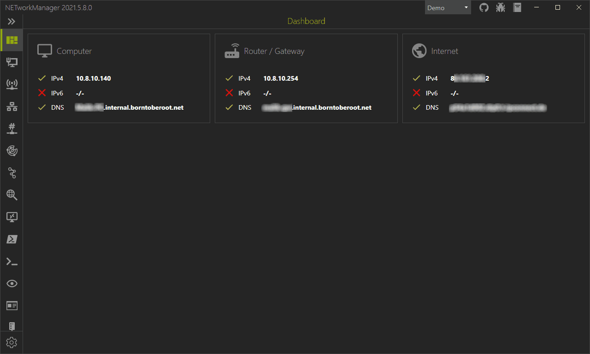

# What is NETworkManager
NETworkManager is a powerful tool for managing networks and troubleshoot network problems! It includes a variety of tools such as an IP scanner, Port Scanner, Ping Monitor, WiFi analyzer, PuTTY/RemoteDesktop with tabs or an LLDP/CDP capture (and many [more](./Features)) in a unified user interface. 

  

    <a href='./Download'>
      
        <button type="button" name="button" class="btn">:package: Download</button>
      
    </a>    
    <a href='https://github.com/BornToBeRoot/NETworkManager' target="_blank">
      
        <button type="button" name="button" class="btn">:octocat: Github</button>
      
    </a> 
  
  
  
   
   
        
        
        
         
  
 
  
 
       
         
  
 
  
 
       
           
         
  
 

The code is open source and available on [GitHub](https://github.com/BornToBeRoot/NETworkManager){:target="_blank"} published under the [GNU General Public License v3](https://github.com/BornToBeRoot/NETworkManager/blob/main/LICENSE){:target="_blank"}. This project has adopted the [code of conduct](https://github.com/BornToBeRoot/NETworkManager/blob/main/CODE_OF_CONDUCT.md){:target="_blank"} defined by the [Contributor Covenant](http://contributor-covenant.org/){:target="_blank"}.
