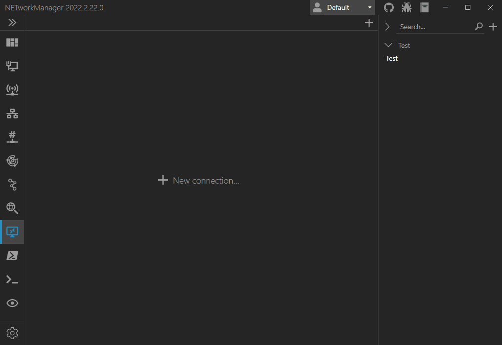
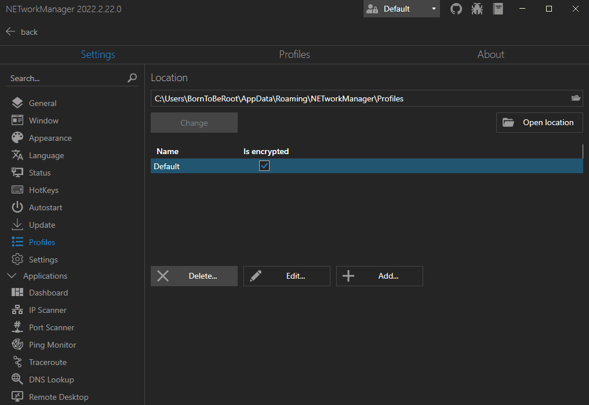
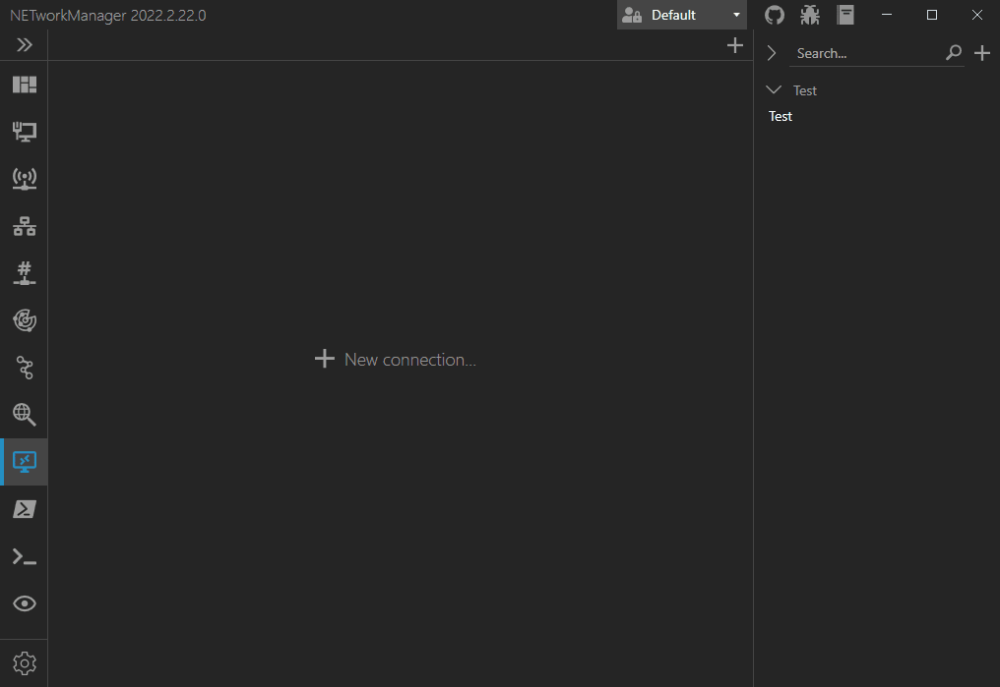

# Frequently Asked Questions

## How to contribute or report an issue?

Read the [contributing guidelines](https://github.com/BornToBeRoot/NETworkManager/blob/master/CONTRIBUTING.md){:target="_blank"} and follow the instructions there.

## How to build the project?

The project can be build with Visual Studio or with a PowerShell script. More details and the requirements can be found in the [README](https://github.com/BornToBeRoot/NETworkManager/blob/master/README.md#build){:target="_blank"}.

## How does the profile encryption work?

Profile files are encrypted on disk using [Rijndael](https://docs.microsoft.com/en-US/dotnet/api/system.security.cryptography.rijndaelmanaged?view=net-5.0) (AES) with a key size of 256 bits and a block size of 128 bits in CBC mode. The encryption key is derived from a master password using [Rfc2898DeriveBytes](https://docs.microsoft.com/en-US/dotnet/api/system.security.cryptography.rfc2898derivebytes?view=net-5.0) (PBKDF2) with 1,000,000 iterations. At runtime, passwords are stored as [SecureString](https://docs.microsoft.com/en-US/dotnet/api/system.security.securestring?view=net-5.0) once the profile file is loaded. For some functions, the password must be converted to a normal string and remains unencrypted in memory until the garbage collector cleans them up.

## How to enable profile file encryption?

Open the settings and go to the profile section. Right click on the profile you want to encrypt. Select `Encryption...` > `Enable encryption...` and set your master password.

## How to change the master password of an encrypted profile file?

Open the settings and go to the profile section. Right click on an encrypted profile. Select `Encryption...` > `Change Master Password...` and enter the current master password and a new master password.

## How to disable profile file encryption?

Open the settings and go to the profile section. Right click on an encrypted profile. Select `Encryption...` > `Disable encryption...` and enter your master password.

