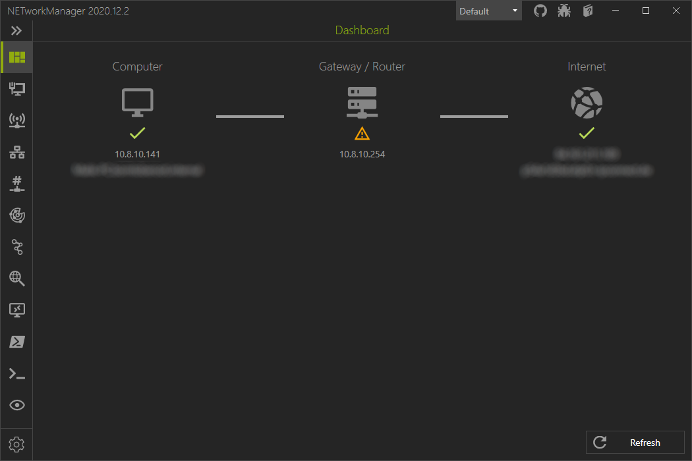

# Dashboard
The dashboard checks automatically and at every status change of the local network adapters (network cable plugged in, WLAN connected, etc.) if there is a connection to the Internet.

First it checks if the local tcp/ip stack is available by sending an ICMP package to `127.0.0.1`. Then the local IP address of the computer is determined based on the local routing. For this the IP address from the [Public ICMP test IP address](#public-icmp-test-ip-address) setting is used. If you have multiple connections to the Internet (e.g. Ethernet and WLAN) the one with the highest metric is used.

The local IP address is used to find out the IP address of the gateway based on the network adapter configuration. To check if the gateway is available, an ICMP packet is sent to this IP address.

To check if the internet connection is established and working, an ICMP package is sent to a public IP address configured in the [Public ICMP test IP address](#public-icmp-test-ip-address) setting. It also checks whether a public DNS A record can be resolved using the [Public DNS test domain](#public-dns-test-domain) setting and a DNS PTR record using the [Public DNS test IP address](#public-dns-test-ip-address) setting. The public IP address is determined with a WebRequest to [api.ipify.org](https://www.ipify.org/){:target="_blank"}.

For each IP address, an attempt is made to resolve the DNS record. The windows dns settings are used for this.



## Settings

### Public ICMP test IP address
A public IP address that is reachable via ICMP.

**Default** 
```
1.1.1.1
```

### Public DNS test domain
A public domain that resolves an A record.

**Default**
```
one.one.one.one
```

### Public DNS test IP address
A public IP address that resolves a PTR record.

**Default** 
```
1.1.1.1
```

### Check public IP address
Enables or disables the resolution of the public IP address via [api.ipify.org](https://www.ipify.org/){:target="_blank"}.

**Default** 
```
Enabled
```

### Use custom API
Override the default API to resolve the public IP address. The API should return only a plain text IPv4 address like `xx.xx.xx.xx`.

**Examples** 
- [api.ipify.org](https://www.ipify.org/){:target="_blank"}
- [ip4.seeip.org](https://ip4.seeip.org/){:target="_blank"}
- [api.my-ip.io/ip](https://api.my-ip.io/ip){:target="_blank"}