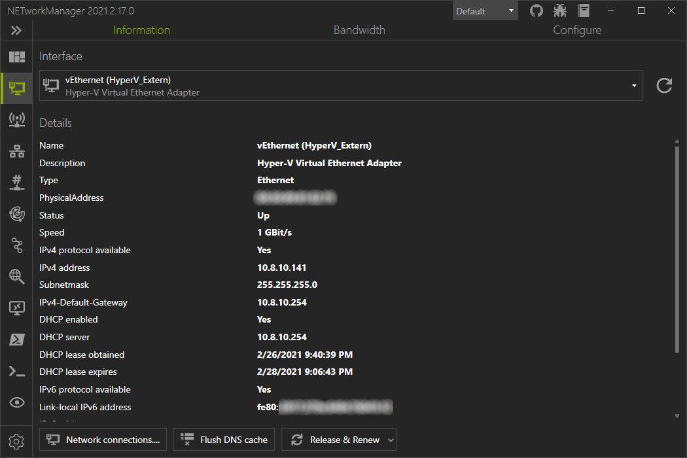
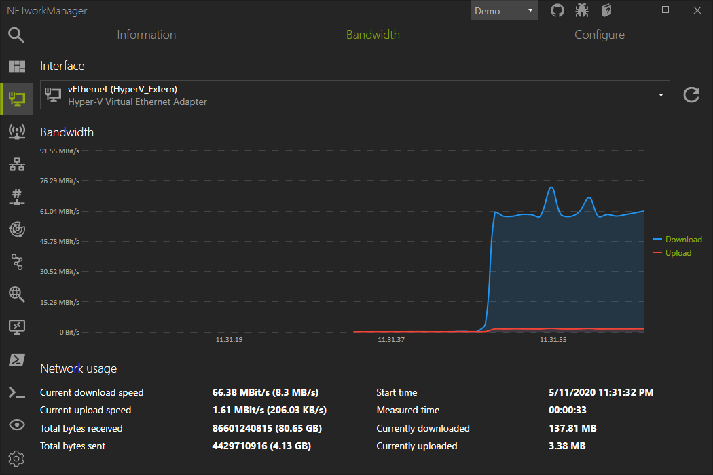
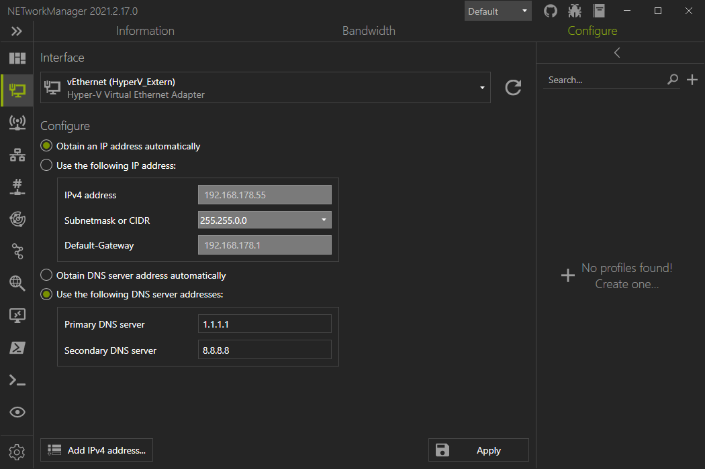

# Network Interface

The **Network Interface** tool detects all network adapters of the computer with the most important information (such as IP addresses, DNS servers, etc.). Connected network cards can be configured using profiles.

## Information

## Bandwidth

## Configure

