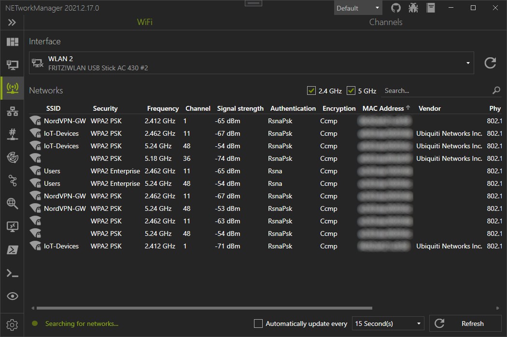
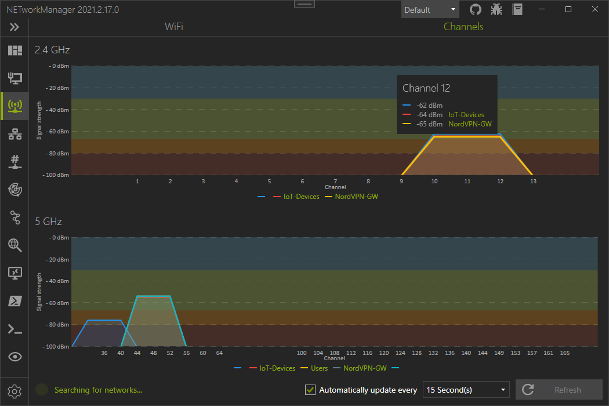

# WiFi
The WiFi shows all available wireless networks with additional details such as channel, signal strength or the type of encryption.

Hidden wireless networks are not displayed. 

## WiFi

You can select which wireless network adapter is used to scan for wireless networks. Wireless networks can be filtered by 2.4 Ghz, 5 Ghz and the SSID.

The found wireless networks can be expanded to show more details.

## Channels

In the "Channels" view, all SSIDs are displayed graphically, with channel and signal strength. This can be useful to identify overlapping SSIDs that are not from the same access point.

You can move the mouse over the channel to display all SSIDs that occupy this channel.

