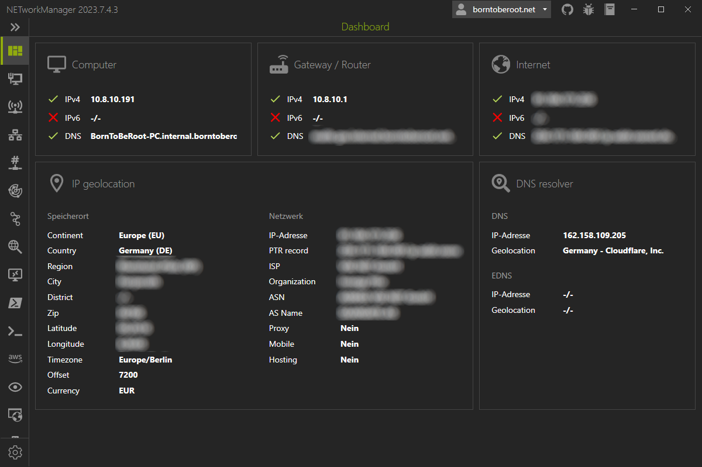

# Dashboard

On the **Dashboard** the status of the current network connection of your computer is displayed to get a quick overview with the most important information.

As soon as the status of the local network adapter changes (Ethernet cable is plugged in, WLAN or VPN is connected, etc.), the connection to the router and Internet is checked.

## Settings

### Public IPv4 address

Public IPv4 address reachable via ICMP.

**Type:** `String`

**Default:** `1.1.1.1`

### Public IPv6 address

Public IPv6 address reachable via ICMP.

**Type:** `String`

**Default:** `2606:4700:4700::1111`

### Check public IP address

Enables or disables the resolution of the public IP address via [`api.ipify.org`](https://www.ipify.org/){:target="\_blank"} and [`api6.ipify.org`](https://www.ipify.org/){:target="\_blank"}.

**Type:** `Boolean`

**Default:** `Enabled`

### Use custom IPv4 address API

Override the default IPv4 address API to resolve the public IP address. The API should return only a plain text IPv4 address like `xx.xx.xx.xx`.

**Type:** `Boolean | String`

**Default:** `Disabled | Empty`

**Example:**

- [`api.ipify.org`](https://api.ipify.org/){:target="\_blank"}
- [`ip4.seeip.org`](https://ip4.seeip.org/){:target="\_blank"}
- [`api.my-ip.io/ip`](https://api.my-ip.io/ip){:target="\_blank"}

### Use custom IPv6 address API

Override the default IPv6 address API to resolve the public IP address. The API should return only a plain text IPv6 address like `xxxx:xx:xxx::xx`.

**Type:** `Boolean | String`

**Default:** `Disabled | Empty`

**Example:**

- [`api6.ipify.org`](https://api6.ipify.org/){:target="\_blank"}
