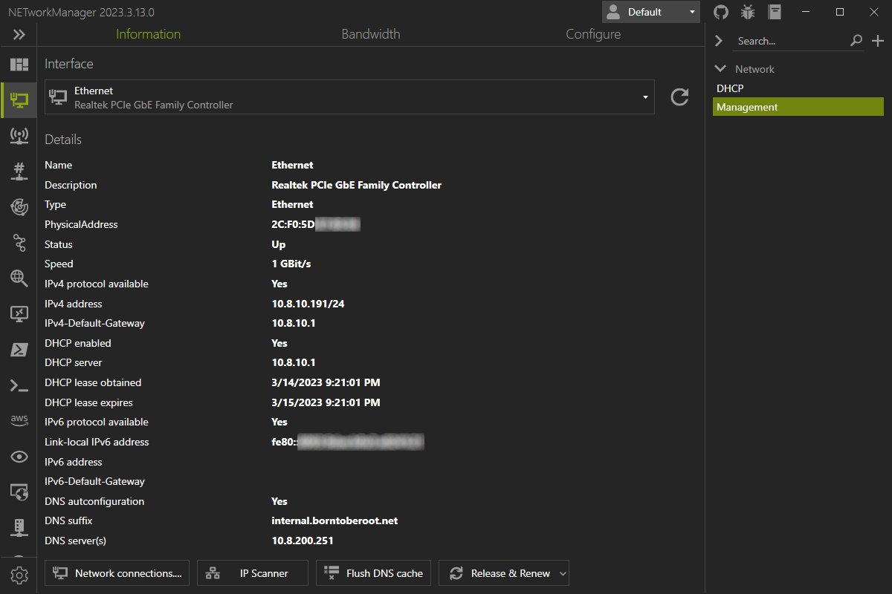
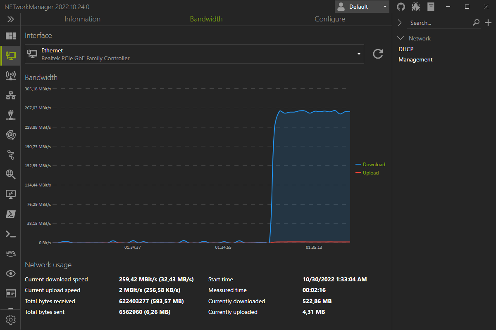
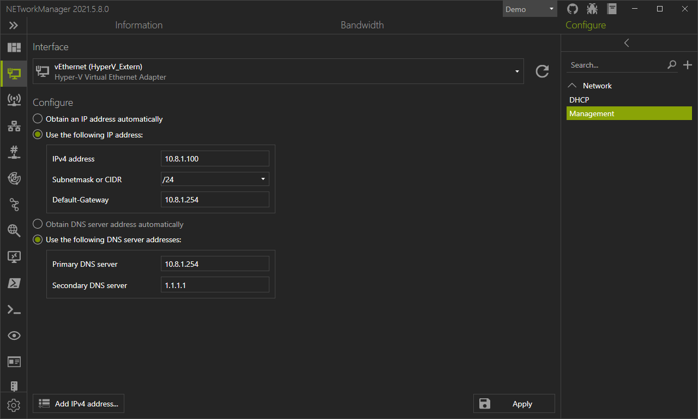

# Network Interface

The tool **Network Interface** detects all network adapter of the computer with the most important information (like IP addresses, DNS servers etc.). The bandwidth of the connected network adapter can be monitored and the configuration can be changed via profiles.

## Information

In the Information view, you can see all the important details of the selected network adapter such as the configured IP addresses, DNS servers, MAC address, and more. If information such as IPv6 configuration is not available, it is hidden in the view.

## Bandwidth

The bandwidth of the selected network adapter is monitored as long as the **Network Interface** tool is selected. If you switch to another tool, monitoring is paused and resets and resumes when you switch again.

You can see the current download and upload speed in Bit/s (B/s). Depending on the bandwith you are using its automatically adjusting to KBit/s (KB/s), MBit/s (MB/s) or GBit/s (GB/s). It also displays since when the bandwidth is measured and how much has been downloaded and uploaded since then.

## Configure

In the configuration view you can change the configuration of the selected network adapter. To change the settings, the network adapter must be connected. The options you can set correspond to the network adapter properties `Internetprotokoll, Version 4 (TCP/IPv4) Properties` in the `Control Panel > Network and Internet > Network Connections`. These are explained in the [profiles section](#profile). Clicking the **Apply** button will launch an elevated PowerShell to configure the network adapter.

The **Add IPv4-address...** button will open a dialog where you can enter an additional IPv4 address and a subnetmask. If you click the the **Add** button, it will be assigned to the selected network adapter.

## Profile
